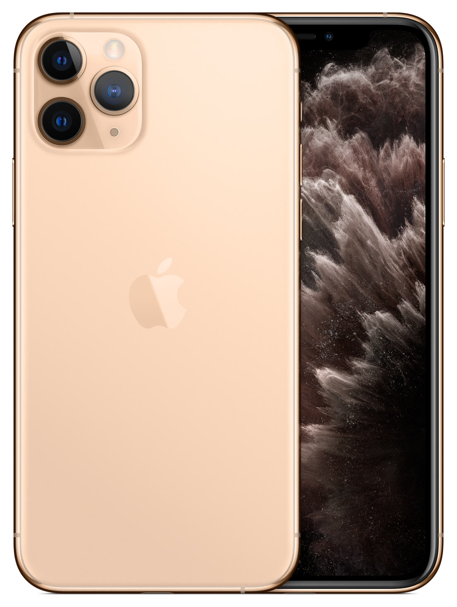

# iPhone 11 Pro

**Model id:** `iphone-11-pro` · **Released:** 2019 · **Generation:** 2019

> Phase 1 research output. Every row cites a source or is explicitly flagged as
> unverified. Nothing here may be transcribed into `src/data/` without its flag
> being read first (SPEC.md §10, D-11).

## Body

| Fact | Value | Source |
|---|---|---|
| Height | 144.0 mm | S1 |
| Width | 71.4 mm | S1 |
| Depth | 8.1 mm | S1 |
| Weight | 188 grams | S1 |
| Display | 5.8‑inch (diagonal) all‑screen OLED Multi‑Touch display | S1 |

## Coarse-tier attributes (SPEC.md §6.1)

| Attribute | Value(s) | Confidence | Source | Note |
|---|---|---|---|---|
| `home_button` | `absent` | ✅ verified | S1 | No home button; Face ID. |
| `port` | `lightning` | ✅ verified | S1 | Listed under External Buttons and Connectors. |
| `rear_camera_count` | `3` | ✅ verified | S1 | |
| `rear_camera_layout` | `triple_square` | 🟡 inferred | — | Three lenses in a triangle inside a large rounded-square raised housing, with the flash (and LiDAR where fitted) on the right. **Arrangement described from the researcher's reading, not a cited source — confirm against a reference image.** |
| `front_cutout` | `notch_wide` | ✅ verified | S3 | Wide notch (~35 mm) at the top of an all-screen display. |
| `body_size_class` | `standard` | ✅ verified | S1 | Derived from body height 144.0 mm against the bands in SPEC.md §6.3. An adjacent class is added only when a model actually in that class sits within 3 mm — see SPEC.md §6.3. |
| `sim_tray` | `right_side` | ✅ verified | S2 | SIM tray on the right side, below the side button. Present in all markets. |
| `colour` | `gold` · `black` · `white_silver` · `dark_green` | 🟡 inferred | S1 | Marketing names are Apple's; the descriptive mapping is this project's (see `reference/palette.md`). |

## Deep-tier attributes (SPEC.md §6.2)

| Attribute | Value | Confidence | Source | Note |
|---|---|---|---|---|
| `action_button` | `absent` | ✅ verified | S1 | Ring/Silent switch fitted instead. |
| `camera_control_button` | `absent` | ✅ verified | S1 |  |
| `frame_material_finish` | `stainless_glossy` | 🟡 inferred | S3 | Polished stainless steel. |
| `back_glass_finish` | `matte` | 🟡 inferred | S3 | Textured matte glass. |
| `rear_wordmark` | `logo_only_centred` | ✅ verified | S5 | Apple logo centred, no "iPhone" wordmark. |
| `bottom_mic_hole_pattern` | `asymmetric` | 🟡 inferred | — | Asymmetric, as on every model after the iPhone X. Only useful for the X/XS pair. |
| `camera_bump_size` | — (n/a) | 🔴 unverified | — | Not a discriminator for this model. |
| `flash_position` | `in_square_right` | 🔴 unverified | — | Inside the square housing, on the right. **Not read off the image yet — confirm against the committed reference image before transcribing.** |
| `lidar` | `absent` | ✅ verified | S1 |  |

## Colours (SPEC.md §6.5)

| Descriptive value | Apple marketing name | Note |
|---|---|---|
| `gold` | Gold |  |
| `black` | Space Gray |  |
| `white_silver` | Silver |  |
| `dark_green` | Midnight Green |  |

All marketing names from S1. Descriptive values per `reference/palette.md`.

## Cautions

- Colour can be wrong on a rehoused phone or one with replaced back glass (SPEC.md §6.4). Treat a colour answer as evidence, not proof.

## Sources

- **S1** — Apple — iPhone 11 Pro Tech Specs — <https://support.apple.com/en-us/111879> (fetched 2026-08-19)
- **S2** — Apple — Remove or switch the SIM card in your iPhone — <https://support.apple.com/en-us/109357> (fetched 2026-08-19)
- **S3** — Wikipedia — iPhone 11 Pro — <https://en.wikipedia.org/wiki/IPhone_11_Pro> (fetched 2026-08-19)
- **S4** — Apple product image, committed as reference/images/apple/iphone-11-pro.jpg — <https://store.storeimages.cdn-apple.com/4982/as-images.apple.com/is/iphone-11-pro-gold-select-2019?wid=1800&hei=1800&fmt=jpeg&qlt=95> (fetched 2026-08-19)
- **S5** — 9to5Mac — Cases show iPhone 11 design, including new position of Apple logo — <https://9to5mac.com/2019/09/08/purported-iphone-11-cases-show-new-position-for-apple-logo-on-iphone-11-back/> (fetched 2026-08-19)

## Reference images

`reference/images/apple/iphone-11-pro.jpg` — Apple's own product shot: one device, back and
front, straight on and unobstructed at 1104x1464. From <https://store.storeimages.cdn-apple.com/4982/as-images.apple.com/is/iphone-11-pro-gold-select-2019?wid=1800&hei=1800&fmt=jpeg&qlt=95>
(downloaded 2026-08-19).

Not captured for this model: the bottom edge (port and mic/speaker hole pattern)
and the side edges. See `reference/images/README.md`.
