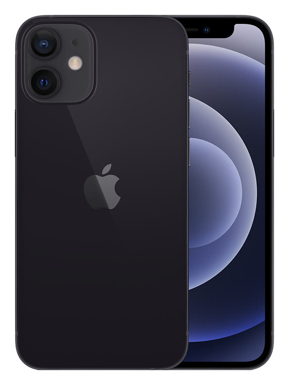

# iPhone 12 mini

**Model id:** `iphone-12-mini` · **Released:** 2020 · **Generation:** 2020

> Phase 1 research output. Every row cites a source or is explicitly flagged as
> unverified. Nothing here may be transcribed into `src/data/` without its flag
> being read first (SPEC.md §10, D-11).

## Body

| Fact                         | Value                                                | Source |
| ---------------------------- | ---------------------------------------------------- | ------ |
| Height                       | 131.5 mm                                             | S1     |
| Width                        | 64.2 mm                                              | S1     |
| Depth                        | 7.4 mm                                               | S1     |
| Weight                       | 135 grams                                            | S1     |
| Display                      | 5.4‑inch (diagonal) all‑screen OLED display          | S1     |
| Apple's material description | Ceramic Shield front, Glass back and aluminum design | S1     |

## Coarse-tier attributes (SPEC.md §6.1)

| Attribute            | Value(s)                                                                  | Confidence  | Source | Note                                                                                                                                                                          |
| -------------------- | ------------------------------------------------------------------------- | ----------- | ------ | ----------------------------------------------------------------------------------------------------------------------------------------------------------------------------- |
| `home_button`        | `absent`                                                                  | ✅ verified | S1     | No home button; Face ID.                                                                                                                                                      |
| `port`               | `lightning`                                                               | ✅ verified | S1     | Listed under External Buttons and Connectors.                                                                                                                                 |
| `rear_camera_count`  | `2`                                                                       | ✅ verified | S1     |                                                                                                                                                                               |
| `rear_camera_layout` | `dual_vertical_square`                                                    | ✅ verified | S4     | Two lenses stacked **vertically** down the left of a large rounded-square raised housing, flash to the right.                                                                 |
| `front_cutout`       | `notch_wide`                                                              | ✅ verified | S1     | Wide notch (~35 mm) at the top of an all-screen display.                                                                                                                      |
| `body_size_class`    | `mini`                                                                    | ✅ verified | S1     | Derived from body height 131.5 mm against the bands in SPEC.md §6.3. An adjacent class is added only when a model actually in that class sits within 3 mm — see SPEC.md §6.3. |
| `sim_tray`           | `left_side`                                                               | ✅ verified | S2     | SIM tray on the left side, below the volume buttons. Present in all markets — the tray moved from right to left with the iPhone 12 generation.                                |
| `colour`             | `black` · `white_silver` · `red` · `light_green` · `dark_blue` · `purple` | 🟡 inferred | S1     | Marketing names are Apple's; the descriptive mapping is this project's (see `reference/palette.md`).                                                                          |

## Deep-tier attributes (SPEC.md §6.2)

| Attribute                 | Value               | Confidence    | Source | Note                                                                                                                                         |
| ------------------------- | ------------------- | ------------- | ------ | -------------------------------------------------------------------------------------------------------------------------------------------- |
| `action_button`           | `absent`            | ✅ verified   | S1     | Ring/Silent switch fitted instead.                                                                                                           |
| `camera_control_button`   | `absent`            | ✅ verified   | S1     |                                                                                                                                              |
| `frame_material_finish`   | `aluminium_matte`   | ✅ verified   | S1     | Anodised aluminium, matte.                                                                                                                   |
| `back_glass_finish`       | `glossy`            | ✅ verified   | S1     | Glossy glass.                                                                                                                                |
| `rear_wordmark`           | `logo_only_centred` | ✅ verified   | S5     | Apple logo centred, no "iPhone" wordmark.                                                                                                    |
| `bottom_mic_hole_pattern` | `asymmetric`        | 🟡 inferred   | —      | Asymmetric, as on every model after the iPhone X. Only useful for the X/XS pair.                                                             |
| `camera_bump_size`        | — (n/a)             | 🔴 unverified | —      | Not a discriminator for this model.                                                                                                          |
| `flash_position`          | `in_square_right`   | 🔴 unverified | —      | Inside the square housing, on the right. **Not read off the image yet — confirm against the committed reference image before transcribing.** |
| `lidar`                   | `absent`            | ✅ verified   | S1     |                                                                                                                                              |

## Colours (SPEC.md §6.5)

| Descriptive value | Apple marketing name | Note                                                                                           |
| ----------------- | -------------------- | ---------------------------------------------------------------------------------------------- |
| `black`           | Black                |                                                                                                |
| `white_silver`    | White                |                                                                                                |
| `red`             | (PRODUCT) RED        |                                                                                                |
| `light_green`     | Green                | Shade resolved per model — Apple reuses this bare name across generations at different shades. |
| `dark_blue`       | Blue                 | Shade resolved per model — Apple reuses this bare name across generations at different shades. |
| `purple`          | Purple               |                                                                                                |

All marketing names from S1. Descriptive values per `reference/palette.md`.

## Cautions

- Colour can be wrong on a rehoused phone or one with replaced back glass (SPEC.md §6.4). Treat a colour answer as evidence, not proof.

## Sources

- **S1** — Apple — iPhone 12 mini Tech Specs — <https://support.apple.com/en-us/111877> (fetched 2026-08-19)
- **S2** — Apple — Remove or switch the SIM card in your iPhone — <https://support.apple.com/en-us/109357> (fetched 2026-08-19)
- **S3** — Apple product image, committed as reference/images/apple/iphone-12-mini.jpg — <https://store.storeimages.cdn-apple.com/4982/as-images.apple.com/is/iphone-12-mini-black-select-2020?wid=1800&hei=1800&fmt=jpeg&qlt=95> (fetched 2026-08-19)
- **S4** — The Next Web — Why did Apple change the camera position on the iPhone 13? — <https://thenextweb.com/news/why-did-apple-change-camera-position-on-iphone-13-analysis> (fetched 2026-08-19)
- **S5** — 9to5Mac — Cases show iPhone 11 design, including new position of Apple logo — <https://9to5mac.com/2019/09/08/purported-iphone-11-cases-show-new-position-for-apple-logo-on-iphone-11-back/> (fetched 2026-08-19)

## Reference images

`reference/images/apple/iphone-12-mini.jpg` — Apple's own product shot: one device, back and
front, straight on and unobstructed at 584x778. From <https://store.storeimages.cdn-apple.com/4982/as-images.apple.com/is/iphone-12-mini-black-select-2020?wid=1800&hei=1800&fmt=jpeg&qlt=95>
(downloaded 2026-08-19).

Not captured for this model: the bottom edge (port and mic/speaker hole pattern)
and the side edges. See `reference/images/README.md`.
