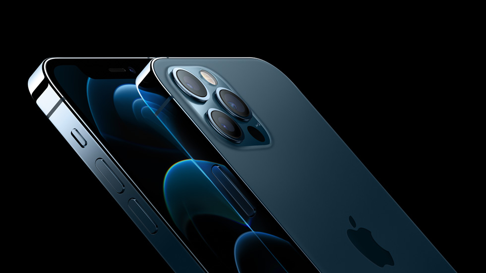

# iPhone 12 Pro Max

**Model id:** `iphone-12-pro-max` · **Released:** 2020 · **Generation:** 2020

> Phase 1 research output. Every row cites a source or is explicitly flagged as
> unverified. Nothing here may be transcribed into `src/data/` without its flag
> being read first (SPEC.md §10, D-11).

## Body

| Fact | Value | Source |
|---|---|---|
| Height | 160.8 mm | S1 |
| Width | 78.1 mm | S1 |
| Depth | 7.4 mm | S1 |
| Weight | 228 grams | S1 |
| Display | 6.7‑inch (diagonal) all‑screen OLED display | S1 |
| Apple's material description | Ceramic Shield front, textured matte glass back and stainless steel design | S1 |

## Coarse-tier attributes (SPEC.md §6.1)

| Attribute | Value(s) | Confidence | Source | Note |
|---|---|---|---|---|
| `home_button` | `absent` | ✅ verified | S1 | No home button; Face ID. |
| `port` | `lightning` | ✅ verified | S1 | Listed under External Buttons and Connectors. |
| `rear_camera_count` | `3` | ✅ verified | S1 | |
| `rear_camera_layout` | `triple_square` | 🟡 inferred | — | Three lenses in a triangle inside a large rounded-square raised housing, with the flash (and LiDAR where fitted) on the right. **Arrangement described from the researcher's reading, not a cited source — confirm against a reference image.** |
| `front_cutout` | `notch_wide` | ✅ verified | S1 | Wide notch (~35 mm) at the top of an all-screen display. |
| `body_size_class` | `max` | ✅ verified | S1 | Derived from body height 160.8 mm against the bands in SPEC.md §6.3. An adjacent class is added only when a model actually in that class sits within 3 mm — see reference/findings.md §5. |
| `sim_tray` | `left_side` | ✅ verified | S2 | SIM tray on the left side, below the volume buttons. Present in all markets — the tray moved from right to left with the iPhone 12 generation. |
| `colour` | `white_silver` · `black` · `gold` · `dark_blue` | 🟡 inferred | S1 | Marketing names are Apple's; the descriptive mapping is this project's (see `reference/palette.md`). |

## Deep-tier attributes (SPEC.md §6.2)

| Attribute | Value | Confidence | Source | Note |
|---|---|---|---|---|
| `action_button` | `absent` | ✅ verified | S1 | Ring/Silent switch fitted instead. |
| `camera_control_button` | `absent` | ✅ verified | S1 |  |
| `frame_material_finish` | `stainless_glossy` | ✅ verified | S1 | Polished stainless steel. |
| `back_glass_finish` | `matte` | ✅ verified | S1 | Textured matte glass. |
| `rear_wordmark` | `logo_only_centred` | ✅ verified | S4 | Apple logo centred, no "iPhone" wordmark. |
| `bottom_mic_hole_pattern` | `asymmetric` | 🟡 inferred | — | Asymmetric, as on every model after the iPhone X. Only useful for the X/XS pair. |
| `camera_bump_size` | — (n/a) | 🔴 unverified | — | Not a discriminator for this model. |
| `flash_position` | `in_square_right` | 🔴 unverified | — | Inside the square housing, on the right. **Not read off the image yet — confirm against the committed reference image before transcribing.** |
| `lidar` | `present` | ✅ verified | S1 | Listed under External Buttons and Connectors. |

## Colours (SPEC.md §6.5)

| Descriptive value | Apple marketing name | Note |
|---|---|---|
| `white_silver` | Silver |  |
| `black` | Graphite |  |
| `gold` | Gold |  |
| `dark_blue` | Pacific Blue |  |

All marketing names from S1. Descriptive values per `reference/palette.md`.

## Cautions

- Colour can be wrong on a rehoused phone or one with replaced back glass (SPEC.md §6.4). Treat a colour answer as evidence, not proof.

## Sources

- **S1** — Apple — iPhone 12 Pro Max Tech Specs — <https://support.apple.com/en-us/111874> (fetched 2026-08-19)
- **S2** — Apple — Remove or switch the SIM card in your iPhone — <https://support.apple.com/en-us/109357> (fetched 2026-08-19)
- **S3** — Apple product image, committed as reference/images/iphone-12-pro-max.jpg — <https://www.apple.com/newsroom/images/product/iphone/standard/Apple_announce-iphone12pro_10132020_big.jpg.large.jpg> (fetched 2026-08-19)
- **S4** — 9to5Mac — Cases show iPhone 11 design, including new position of Apple logo — <https://9to5mac.com/2019/09/08/purported-iphone-11-cases-show-new-position-for-apple-logo-on-iphone-11-back/> (fetched 2026-08-19)

## Reference images

`reference/images/iphone-12-pro-max.jpg` — official Apple product image, from <https://www.apple.com/newsroom/images/product/iphone/standard/Apple_announce-iphone12pro_10132020_big.jpg.large.jpg> (downloaded 2026-08-19). Shows the rear in every finish plus the front.

Not yet captured for this model: bottom edge (port and mic/speaker hole pattern) and the side edges. See `reference/images/README.md`.
