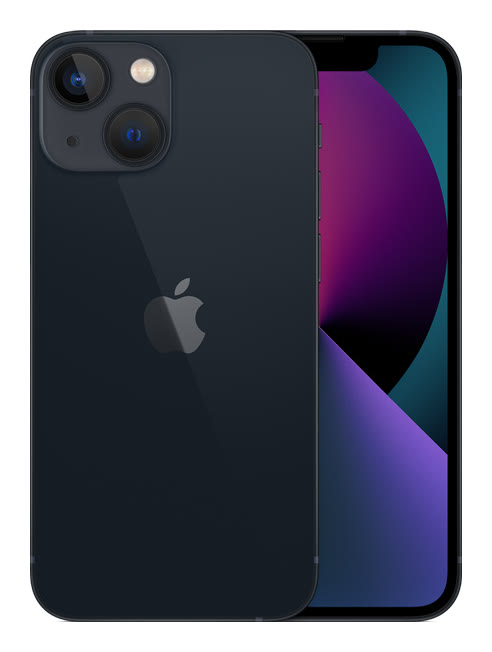

# iPhone 13 mini

**Model id:** `iphone-13-mini` · **Released:** 2021 · **Generation:** 2021

> Phase 1 research output. Every row cites a source or is explicitly flagged as
> unverified. Nothing here may be transcribed into `src/data/` without its flag
> being read first (SPEC.md §10, D-11).

## Body

| Fact                         | Value                                                | Source |
| ---------------------------- | ---------------------------------------------------- | ------ |
| Height                       | 131.5 mm                                             | S1     |
| Width                        | 64.2 mm                                              | S1     |
| Depth                        | 7.65 mm                                              | S1     |
| Weight                       | 141 grams                                            | S1     |
| Display                      | 5.4‑inch (diagonal) all‑screen OLED display          | S1     |
| Apple's material description | Ceramic Shield front, Glass back and aluminum design | S1     |

## Coarse-tier attributes (SPEC.md §6.1)

| Attribute            | Value(s)                                                                              | Confidence  | Source | Note                                                                                                                                                                                                             |
| -------------------- | ------------------------------------------------------------------------------------- | ----------- | ------ | ---------------------------------------------------------------------------------------------------------------------------------------------------------------------------------------------------------------- |
| `home_button`        | `absent`                                                                              | ✅ verified | S1     | No home button; Face ID.                                                                                                                                                                                         |
| `port`               | `lightning`                                                                           | ✅ verified | S1     | Listed under External Buttons and Connectors.                                                                                                                                                                    |
| `rear_camera_count`  | `2`                                                                                   | ✅ verified | S1     |                                                                                                                                                                                                                  |
| `rear_camera_layout` | `dual_diagonal_square`                                                                | ✅ verified | S4     | Two lenses arranged **diagonally** (top-left and bottom-right) inside a large rounded-square raised housing.                                                                                                     |
| `front_cutout`       | `notch_narrow`                                                                        | ✅ verified | S5     | Narrow notch (~28 mm, 20% narrower than the iPhone 12 generation).                                                                                                                                               |
| `body_size_class`    | `small`                                                                               | ✅ verified | S1     | Derived from body height 131.5 mm against the bands in SPEC.md §6.3. The three bands sit in the gaps between the clusters the bodies form, and every model carries exactly one class (SPEC.md §6.3, D-30, D-31). |
| `sim_tray`           | `left_side`                                                                           | ✅ verified | S2     | SIM tray on the left side, below the volume buttons. Present in all markets — the tray moved from right to left with the iPhone 12 generation.                                                                   |
| `colour`             | `red` · `white_silver` · `black` · `light_blue` · `dark_blue` · `pink` · `dark_green` | 🟡 inferred | S1     | Marketing names are Apple's; the descriptive mapping is this project's (see `reference/palette.md`).                                                                                                             |

## Deep-tier attributes (SPEC.md §6.2)

| Attribute                 | Value                           | Confidence    | Source | Note                                                                                                                                                                                                                                                                                                                                                                                                                                 |
| ------------------------- | ------------------------------- | ------------- | ------ | ------------------------------------------------------------------------------------------------------------------------------------------------------------------------------------------------------------------------------------------------------------------------------------------------------------------------------------------------------------------------------------------------------------------------------------ |
| `action_button`           | `absent`                        | ✅ verified   | S1     | Ring/Silent switch fitted instead.                                                                                                                                                                                                                                                                                                                                                                                                   |
| `camera_control_button`   | `absent`                        | ✅ verified   | S1     |                                                                                                                                                                                                                                                                                                                                                                                                                                      |
| `magsafe`                 | `present`                       | ✅ verified   | S1     | Apple's tech specs state MagSafe wireless charging explicitly.                                                                                                                                                                                                                                                                                                                                                                       |
| `frame_material_finish`   | `aluminium_matte`               | ✅ verified   | S1     | Anodised aluminium, matte.                                                                                                                                                                                                                                                                                                                                                                                                           |
| `back_glass_finish`       | `glossy`                        | ✅ verified   | S1     | Glossy glass.                                                                                                                                                                                                                                                                                                                                                                                                                        |
| `rear_wordmark`           | `logo_only_centred`             | 🟡 inferred   | S6     | Apple logo centred, no "iPhone" wordmark. Cited source covers the 2019 change; continuation to this model is assumed — confirm against a reference image.                                                                                                                                                                                                                                                                            |
| `bottom_mic_hole_pattern` | — (generalisation, not counted) | 🔴 unverified | —      | Recorded as `asymmetric` in Phase 1 by generalisation from the iPhone X onward — no source consulted, no holes counted on this model. Downgraded from 🟡 in Phase 2: the catch-all is a **superset** of the specific counts, so under the SPEC.md §5.4 matching rule a technician who truthfully counts the holes on this phone eliminates it and lands on an iPhone X, XS or XS Max. Left absent instead, which eliminates nothing. |
| `camera_bump_size`        | `smaller`                       | ✅ verified   | S3     | Compared within the diagonal-dual family. Measured off the committed product shots with each body normalised to the same width: the 14 generation plateau is visibly wider and its lens elements larger than the 13 generation at equal body width.                                                                                                                                                                                  |
| `flash_position`          | `in_square_right`               | ✅ verified   | —      | Inside the square housing, upper right. Read off the committed product shot at enlargement.                                                                                                                                                                                                                                                                                                                                          |
| `lidar`                   | `absent`                        | ✅ verified   | S1     |                                                                                                                                                                                                                                                                                                                                                                                                                                      |

## Colours (SPEC.md §6.5)

| Descriptive value | Apple marketing name | Note                                                                                           |
| ----------------- | -------------------- | ---------------------------------------------------------------------------------------------- |
| `red`             | (PRODUCT)RED         |                                                                                                |
| `white_silver`    | Starlight            |                                                                                                |
| `black`           | Midnight             |                                                                                                |
| `light_blue`      | Blue                 | Boundary shade: carries both values so neither answer can eliminate this model.                |
| `dark_blue`       | Blue                 | Boundary shade: carries both values so neither answer can eliminate this model.                |
| `pink`            | Pink                 |                                                                                                |
| `dark_green`      | Green                | Shade resolved per model — Apple reuses this bare name across generations at different shades. |

All marketing names from S1. Descriptive values per `reference/palette.md`.

## Cautions

- Same body and camera arrangement as the iPhone 14 family. The iPhone 13 has a SIM tray in every market; a US iPhone 14 has none. The iPhone 13 camera plateau is the smaller of the two.
- Colour can be wrong on a rehoused phone or one with replaced back glass (SPEC.md §6.4). Treat a colour answer as evidence, not proof.

## Sources

- **S1** — Apple — iPhone 13 mini Tech Specs — <https://support.apple.com/en-us/111873> (fetched 2026-08-19)
- **S2** — Apple — Remove or switch the SIM card in your iPhone — <https://support.apple.com/en-us/109357> (fetched 2026-08-19)
- **S3** — Apple product image, committed as reference/images/apple/iphone-13-mini.jpg — <https://store.storeimages.cdn-apple.com/4982/as-images.apple.com/is/iphone-13-mini-midnight-select-2021?wid=1800&hei=1800&fmt=jpeg&qlt=95> (fetched 2026-08-19)
- **S4** — The Next Web — Why did Apple change the camera position on the iPhone 13? — <https://thenextweb.com/news/why-did-apple-change-camera-position-on-iphone-13-analysis> (fetched 2026-08-19)
- **S5** — MacRumors — iPhone 13 Models Feature 20% Smaller Notch — <https://www.macrumors.com/2021/09/14/iphone-13-models-notch-taller/> (fetched 2026-08-19)
- **S6** — 9to5Mac — Cases show iPhone 11 design, including new position of Apple logo — <https://9to5mac.com/2019/09/08/purported-iphone-11-cases-show-new-position-for-apple-logo-on-iphone-11-back/> (fetched 2026-08-19)
- **S7** — wccftech — iPhone 14 Pro Max Camera Bump Compared With iPhone 13 Pro Max — <https://wccftech.com/iphone-14-pro-max-vs-iphone-13-pro-max-camera-bump-comparison/> (fetched 2026-08-19)

## Reference images

`reference/images/apple/iphone-13-mini.jpg` — Apple's own product shot: one device, back and
front, straight on and unobstructed at 492x652. From <https://store.storeimages.cdn-apple.com/4982/as-images.apple.com/is/iphone-13-mini-midnight-select-2021?wid=1800&hei=1800&fmt=jpeg&qlt=95>
(downloaded 2026-08-19).

Not captured for this model: the bottom edge (port and mic/speaker hole pattern)
and the side edges. See `reference/images/README.md`.
