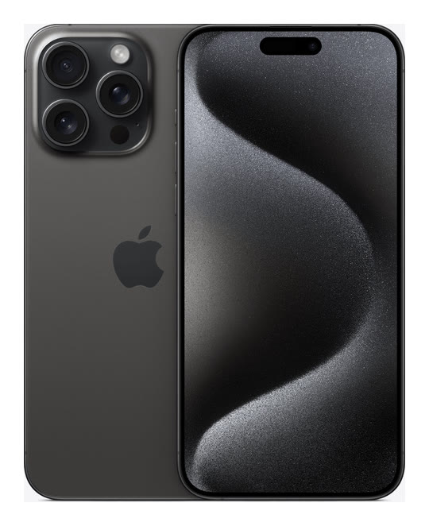

# iPhone 15 Pro Max

**Model id:** `iphone-15-pro-max` · **Released:** 2023 · **Generation:** 2023

> Phase 1 research output. Every row cites a source or is explicitly flagged as
> unverified. Nothing here may be transcribed into `src/data/` without its flag
> being read first (SPEC.md §10, D-11).

## Body

| Fact                         | Value                                                            | Source |
| ---------------------------- | ---------------------------------------------------------------- | ------ |
| Height                       | 159.9 mm                                                         | S1     |
| Width                        | 76.7 mm                                                          | S1     |
| Depth                        | 8.25 mm                                                          | S1     |
| Weight                       | 221 grams                                                        | S1     |
| Display                      | 6.7‑inch (diagonal) all‑screen OLED display                      | S1     |
| Apple's material description | Titanium design, Ceramic Shield front, Textured matte glass back | S1     |

## Coarse-tier attributes (SPEC.md §6.1)

| Attribute            | Value(s)                               | Confidence  | Source | Note                                                                                                                                                                                                                                            |
| -------------------- | -------------------------------------- | ----------- | ------ | ----------------------------------------------------------------------------------------------------------------------------------------------------------------------------------------------------------------------------------------------- |
| `home_button`        | `absent`                               | ✅ verified | S1     | No home button; Face ID.                                                                                                                                                                                                                        |
| `port`               | `usb_c`                                | ✅ verified | S1     | Listed under External Buttons and Connectors.                                                                                                                                                                                                   |
| `rear_camera_count`  | `3`                                    | ✅ verified | S1     |                                                                                                                                                                                                                                                 |
| `rear_camera_layout` | `triple_square`                        | 🟡 inferred | —      | Three lenses in a triangle inside a large rounded-square raised housing, with the flash (and LiDAR where fitted) on the right. **Arrangement described from the researcher's reading, not a cited source — confirm against a reference image.** |
| `front_cutout`       | `dynamic_island`                       | ✅ verified | S1     | Pill-shaped Dynamic Island cutout, detached from the top edge.                                                                                                                                                                                  |
| `body_size_class`    | `large`                                | ✅ verified | S1     | Derived from body height 159.9 mm against the bands in SPEC.md §6.3. The three bands sit in the gaps between the clusters the bodies form, and every model carries exactly one class (SPEC.md §6.3, D-30, D-31).                                |
| `sim_tray`           | `left_side` · `none`                   | ✅ verified | S2     | SIM tray on the left side on units sold outside the United States. US-purchased units have **no SIM tray at all** (eSIM only). Both bodies are in circulation, so tray presence narrows region, not model.                                      |
| `colour`             | `black` · `white_silver` · `dark_blue` | 🟡 inferred | S1     | Marketing names are Apple's; the descriptive mapping is this project's (see `reference/palette.md`).                                                                                                                                            |

## Deep-tier attributes (SPEC.md §6.2)

| Attribute                 | Value                           | Confidence        | Source | Note                                                                                                                                                                                                                                                                                                                                                                                                                                 |
| ------------------------- | ------------------------------- | ----------------- | ------ | ------------------------------------------------------------------------------------------------------------------------------------------------------------------------------------------------------------------------------------------------------------------------------------------------------------------------------------------------------------------------------------------------------------------------------------ |
| `action_button`           | `present`                       | ✅ verified       | S1     | Replaces the ring/silent switch.                                                                                                                                                                                                                                                                                                                                                                                                     |
| `camera_control_button`   | `absent`                        | ✅ verified       | S1     |                                                                                                                                                                                                                                                                                                                                                                                                                                      |
| `magsafe`                 | `present`                       | ✅ verified       | S1     | Apple's tech specs state MagSafe wireless charging explicitly.                                                                                                                                                                                                                                                                                                                                                                       |
| `frame_material_finish`   | `titanium_brushed`              | ✅ verified       | S1     | Brushed titanium.                                                                                                                                                                                                                                                                                                                                                                                                                    |
| `back_glass_finish`       | `matte`                         | ✅ verified       | S1     | Textured matte glass.                                                                                                                                                                                                                                                                                                                                                                                                                |
| `rear_wordmark`           | `logo_only_centred`             | 🟡 inferred       | S4     | Apple logo centred, no "iPhone" wordmark. Cited source covers the 2019 change; continuation to this model is assumed — confirm against a reference image.                                                                                                                                                                                                                                                                            |
| `bottom_mic_hole_pattern` | — (generalisation, not counted) | 🔴 unverified     | —      | Recorded as `asymmetric` in Phase 1 by generalisation from the iPhone X onward — no source consulted, no holes counted on this model. Downgraded from 🟡 in Phase 2: the catch-all is a **superset** of the specific counts, so under the SPEC.md §5.4 matching rule a technician who truthfully counts the holes on this phone eliminates it and lands on an iPhone X, XS or XS Max. Left absent instead, which eliminates nothing. |
| `camera_bump_size`        | —                               | ⚪ not applicable | —      | Not applicable. The value is relative to a `rear_camera_layout` family (SPEC.md §6.2) and this model is outside the diagonal-dual family, so there is nothing to compare it against.                                                                                                                                                                                                                                                 |
| `flash_position`          | `in_square_right`               | ✅ verified       | —      | Inside the square housing, upper right; LiDAR sits lower right. Read off the committed product shot at enlargement.                                                                                                                                                                                                                                                                                                                  |
| `lidar`                   | `present`                       | ✅ verified       | S1     | Listed under External Buttons and Connectors.                                                                                                                                                                                                                                                                                                                                                                                        |

## Colours (SPEC.md §6.5)

| Descriptive value | Apple marketing name | Note |
| ----------------- | -------------------- | ---- |
| `black`           | Black Titanium       |      |
| `white_silver`    | White Titanium       |      |
| `dark_blue`       | Blue Titanium        |      |
| `white_silver`    | Natural Titanium     |      |

All marketing names from S1. Descriptive values per `reference/palette.md`.

## Cautions

- US and non-US bodies differ: a missing SIM tray does **not** rule this model out, and a present tray does not rule out a US-market sibling generation.
- Colour can be wrong on a rehoused phone or one with replaced back glass (SPEC.md §6.4). Treat a colour answer as evidence, not proof.

## Sources

- **S1** — Apple — iPhone 15 Pro Max Tech Specs — <https://support.apple.com/en-us/111828> (fetched 2026-08-19)
- **S2** — Apple — Remove or switch the SIM card in your iPhone — <https://support.apple.com/en-us/109357> (fetched 2026-08-19)
- **S3** — Apple product image, committed as reference/images/apple/iphone-15-pro-max.jpg — <https://store.storeimages.cdn-apple.com/4982/as-images.apple.com/is/iphone-15-pro-finish-select-202309-6-7inch-blacktitanium?wid=1800&hei=1800&fmt=jpeg&qlt=95> (fetched 2026-08-19)
- **S4** — 9to5Mac — Cases show iPhone 11 design, including new position of Apple logo — <https://9to5mac.com/2019/09/08/purported-iphone-11-cases-show-new-position-for-apple-logo-on-iphone-11-back/> (fetched 2026-08-19)

## Reference images

`reference/images/apple/iphone-15-pro-max.jpg` — Apple's own product shot: one device, back and
front, straight on and unobstructed at 540x662. From <https://store.storeimages.cdn-apple.com/4982/as-images.apple.com/is/iphone-15-pro-finish-select-202309-6-7inch-blacktitanium?wid=1800&hei=1800&fmt=jpeg&qlt=95>
(downloaded 2026-08-19).

Not captured for this model: the bottom edge (port and mic/speaker hole pattern)
and the side edges. See `reference/images/README.md`.
