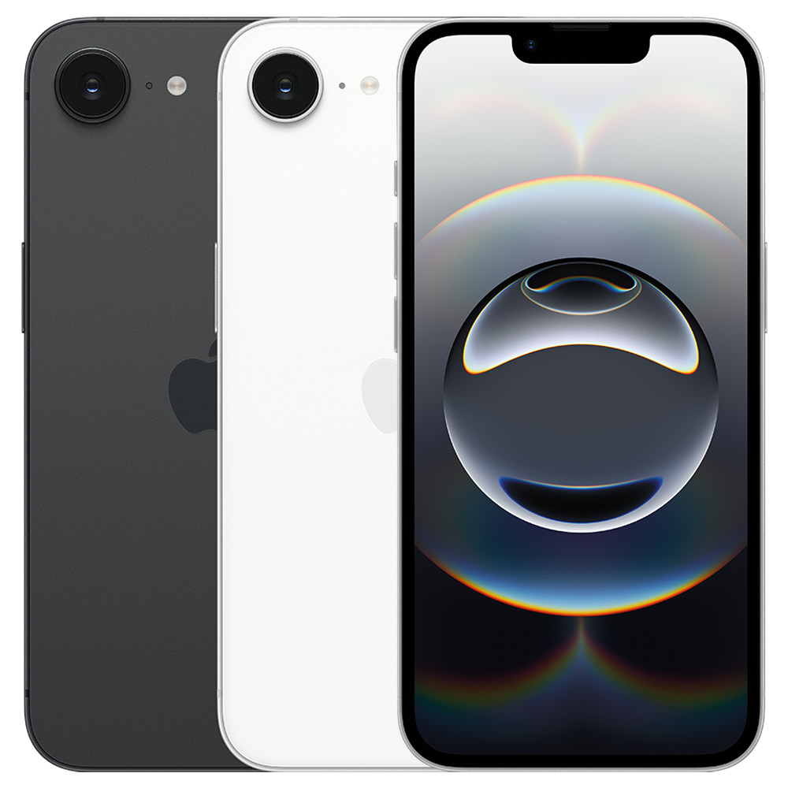

# iPhone 16e

**Model id:** `iphone-16e` · **Released:** 2025 · **Generation:** 2025

> Phase 1 research output. Every row cites a source or is explicitly flagged as
> unverified. Nothing here may be transcribed into `src/data/` without its flag
> being read first (SPEC.md §10, D-11).

## Body

| Fact | Value | Source |
|---|---|---|
| Height | 146.7 mm | S1 |
| Width | 71.5 mm | S1 |
| Depth | 7.80 mm | S1 |
| Weight | 167 grams | S1 |
| Display | 6.1‑inch (diagonal) all‑screen OLED display | S1 |
| Apple's material description | Aluminum design, Ceramic Shield front, Glass back | S1 |

## Coarse-tier attributes (SPEC.md §6.1)

| Attribute | Value(s) | Confidence | Source | Note |
|---|---|---|---|---|
| `home_button` | `absent` | ✅ verified | S1 | No home button; Face ID. |
| `port` | `usb_c` | ✅ verified | S1 | Listed under External Buttons and Connectors. |
| `rear_camera_count` | `1` | ✅ verified | S1 | |
| `rear_camera_layout` | `single_lens_no_housing` | ✅ verified | S4 | One circular lens protruding directly from the back glass at the top left. No raised plateau or housing around it. |
| `front_cutout` | `notch_narrow` | 🟡 inferred | S5 | Narrow notch (~28 mm, 20% narrower than the iPhone 12 generation). Notch width inferred from the shared iPhone 14 chassis — confirm against a reference image. |
| `body_size_class` | `standard` | ✅ verified | S1 | Derived from body height 146.7 mm against the bands in SPEC.md §6.3. An adjacent class is added only when a model actually in that class sits within 3 mm — see reference/findings.md §5. |
| `sim_tray` | `left_side` · `none` | ✅ verified | S2 | SIM tray on the left side on units sold outside the United States. US-purchased units have **no SIM tray at all** (eSIM only). Both bodies are in circulation, so tray presence narrows region, not model. |
| `colour` | `black` · `white_silver` | 🟡 inferred | S1 | Marketing names are Apple's; the descriptive mapping is this project's (see `reference/palette.md`). |

## Deep-tier attributes (SPEC.md §6.2)

| Attribute | Value | Confidence | Source | Note |
|---|---|---|---|---|
| `action_button` | `present` | ✅ verified | S1 | Replaces the ring/silent switch. |
| `camera_control_button` | `absent` | ✅ verified | S1 |  |
| `frame_material_finish` | `aluminium_matte` | ✅ verified | S1 | Anodised aluminium, matte. |
| `back_glass_finish` | `glossy` | ✅ verified | S1 | Glossy glass. |
| `rear_wordmark` | `logo_only_centred` | 🟡 inferred | S6 | Apple logo centred, no "iPhone" wordmark. Cited source covers the 2019 change; continuation to this model is assumed — confirm against a reference image. |
| `bottom_mic_hole_pattern` | `asymmetric` | 🟡 inferred | — | Asymmetric, as on every model after the iPhone X. Only useful for the X/XS pair. |
| `camera_bump_size` | — (n/a) | 🔴 unverified | — | Not a discriminator for this model. |
| `flash_position` | `beside_lens_on_glass` | 🔴 unverified | — | On the back glass beside the lens. **Not read off the image yet — confirm against the committed reference image before transcribing.** |
| `lidar` | `absent` | ✅ verified | S1 |  |

## Colours (SPEC.md §6.5)

| Descriptive value | Apple marketing name | Note |
|---|---|---|
| `black` | Black |  |
| `white_silver` | White |  |

All marketing names from S1. Descriptive values per `reference/palette.md`.

## Cautions

- US and non-US bodies differ: a missing SIM tray does **not** rule this model out, and a present tray does not rule out a US-market sibling generation.
- Externally near-identical to the iPhone 17e: same 146.7 x 71.5 x 7.80 mm body, same notch, same single rear lens, same Action button and no Camera Control. Only the 17e Soft Pink finish separates them by sight. Workbench tiebreaker that does not need the phone to power on: the 17e supports MagSafe and the 16e does not, so a MagSafe puck or magnetic accessory snaps to a 17e and will not hold on a 16e. See reference/findings.md section 2.
- Colour can be wrong on a rehoused phone or one with replaced back glass (SPEC.md §6.4). Treat a colour answer as evidence, not proof.

## Sources

- **S1** — Apple — iPhone 16e Tech Specs — <https://support.apple.com/en-us/122208> (fetched 2026-08-19)
- **S2** — Apple — Remove or switch the SIM card in your iPhone — <https://support.apple.com/en-us/109357> (fetched 2026-08-19)
- **S3** — Apple product image, committed as reference/images/iphone-16e.png — <https://cdsassets.apple.com/live/7WUAS350/images/tech-specs/122208-iphone-16e.png> (fetched 2026-08-19)
- **S4** — Daring Fireball — The iPhone 16e (describes the lens protruding with no camera plateau) — <https://daringfireball.net/2025/02/the_iphone_16e> (fetched 2026-08-19)
- **S5** — MacRumors — iPhone 17e to Gain Dynamic Island (states iPhone 16e is the only model with a notch) — <https://www.macrumors.com/2026/01/15/iphone-17e-dynamic-island-60hz/> (fetched 2026-08-19)
- **S6** — 9to5Mac — Cases show iPhone 11 design, including new position of Apple logo — <https://9to5mac.com/2019/09/08/purported-iphone-11-cases-show-new-position-for-apple-logo-on-iphone-11-back/> (fetched 2026-08-19)

## Reference images

`reference/images/iphone-16e.png` — official Apple product image, from <https://cdsassets.apple.com/live/7WUAS350/images/tech-specs/122208-iphone-16e.png> (downloaded 2026-08-19). Shows the rear in every finish plus the front.

Not yet captured for this model: bottom edge (port and mic/speaker hole pattern) and the side edges. See `reference/images/README.md`.
