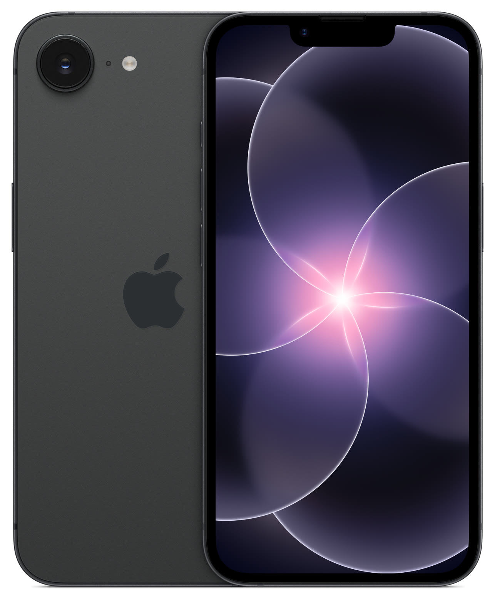

# iPhone 17e

**Model id:** `iphone-17e` · **Released:** 2026 · **Generation:** 2026

> Phase 1 research output. Every row cites a source or is explicitly flagged as
> unverified. Nothing here may be transcribed into `src/data/` without its flag
> being read first (SPEC.md §10, D-11).

## Body

| Fact                         | Value                                               | Source |
| ---------------------------- | --------------------------------------------------- | ------ |
| Height                       | 146.7 mm                                            | S1     |
| Width                        | 71.5 mm                                             | S1     |
| Depth                        | 7.80 mm                                             | S1     |
| Weight                       | 169 grams                                           | S1     |
| Display                      | 6.1‑inch (diagonal) all‑screen OLED display         | S1     |
| Apple's material description | Aluminum design, Ceramic Shield 2 front, Glass back | S1     |

## Coarse-tier attributes (SPEC.md §6.1)

| Attribute            | Value(s)                          | Confidence  | Source | Note                                                                                                                                                                                                       |
| -------------------- | --------------------------------- | ----------- | ------ | ---------------------------------------------------------------------------------------------------------------------------------------------------------------------------------------------------------- |
| `home_button`        | `absent`                          | ✅ verified | S1     | No home button; Face ID.                                                                                                                                                                                   |
| `port`               | `usb_c`                           | ✅ verified | S1     | Listed under External Buttons and Connectors.                                                                                                                                                              |
| `rear_camera_count`  | `1`                               | ✅ verified | S1     |                                                                                                                                                                                                            |
| `rear_camera_layout` | `single_lens_no_housing`          | ✅ verified | S4     | One circular lens protruding directly from the back glass at the top left. No raised plateau or housing around it.                                                                                         |
| `front_cutout`       | `notch_narrow`                    | ✅ verified | S4     | Narrow notch (~28 mm, 20% narrower than the iPhone 12 generation).                                                                                                                                         |
| `body_size_class`    | `standard`                        | ✅ verified | S1     | Derived from body height 146.7 mm against the bands in SPEC.md §6.3. An adjacent class is added only when a model actually in that class sits within 3 mm — see SPEC.md §6.3.                              |
| `sim_tray`           | `left_side` · `none`              | ✅ verified | S2     | SIM tray on the left side on units sold outside the United States. US-purchased units have **no SIM tray at all** (eSIM only). Both bodies are in circulation, so tray presence narrows region, not model. |
| `colour`             | `black` · `white_silver` · `pink` | 🟡 inferred | S1     | Marketing names are Apple's; the descriptive mapping is this project's (see `reference/palette.md`).                                                                                                       |

## Deep-tier attributes (SPEC.md §6.2)

| Attribute                 | Value                           | Confidence        | Source | Note                                                                                                                                                                                                                                                                                                                                                                                                                                 |
| ------------------------- | ------------------------------- | ----------------- | ------ | ------------------------------------------------------------------------------------------------------------------------------------------------------------------------------------------------------------------------------------------------------------------------------------------------------------------------------------------------------------------------------------------------------------------------------------ |
| `action_button`           | `present`                       | ✅ verified       | S1     | Replaces the ring/silent switch.                                                                                                                                                                                                                                                                                                                                                                                                     |
| `camera_control_button`   | `absent`                        | ✅ verified       | S1     |                                                                                                                                                                                                                                                                                                                                                                                                                                      |
| `magsafe`                 | `present`                       | ✅ verified       | S1     | MagSafe present. Apple's tech specs list "MagSafe and Wireless Charging", a magnet array and an alignment magnet — the iPhone 16e has none of these. **This is the iPhone 16e / 17e tiebreaker** (SPEC.md §4.4).                                                                                                                                                                                                                     |
| `frame_material_finish`   | `aluminium_matte`               | ✅ verified       | S1     | Anodised aluminium, matte.                                                                                                                                                                                                                                                                                                                                                                                                           |
| `back_glass_finish`       | `glossy`                        | ✅ verified       | S1     | Glossy glass.                                                                                                                                                                                                                                                                                                                                                                                                                        |
| `rear_wordmark`           | `logo_only_centred`             | 🟡 inferred       | S5     | Apple logo centred, no "iPhone" wordmark. Cited source covers the 2019 change; continuation to this model is assumed — confirm against a reference image.                                                                                                                                                                                                                                                                            |
| `bottom_mic_hole_pattern` | — (generalisation, not counted) | 🔴 unverified     | —      | Recorded as `asymmetric` in Phase 1 by generalisation from the iPhone X onward — no source consulted, no holes counted on this model. Downgraded from 🟡 in Phase 2: the catch-all is a **superset** of the specific counts, so under the SPEC.md §5.4 matching rule a technician who truthfully counts the holes on this phone eliminates it and lands on an iPhone X, XS or XS Max. Left absent instead, which eliminates nothing. |
| `camera_bump_size`        | —                               | ⚪ not applicable | —      | Not applicable. The value is relative to a `rear_camera_layout` family (SPEC.md §6.2) and this model is outside the diagonal-dual family, so there is nothing to compare it against.                                                                                                                                                                                                                                                 |
| `flash_position`          | `beside_lens_on_glass`          | ✅ verified       | —      | To the right of the lens on the bare glass, past the mic hole. Read off the committed product shot at enlargement.                                                                                                                                                                                                                                                                                                                   |
| `lidar`                   | `absent`                        | ✅ verified       | S1     |                                                                                                                                                                                                                                                                                                                                                                                                                                      |

## Colours (SPEC.md §6.5)

| Descriptive value | Apple marketing name | Note |
| ----------------- | -------------------- | ---- |
| `black`           | Black                |      |
| `white_silver`    | White                |      |
| `pink`            | Soft Pink            |      |

All marketing names from S1. Descriptive values per `reference/palette.md`.

## Cautions

- US and non-US bodies differ: a missing SIM tray does **not** rule this model out, and a present tray does not rule out a US-market sibling generation.
- Externally near-identical to the iPhone 16e: same 146.7 x 71.5 x 7.80 mm body, same notch, same single rear lens, same Action button and no Camera Control. Only the 17e Soft Pink finish separates them by sight. Workbench tiebreaker that does not need the phone to power on: the 17e supports MagSafe and the 16e does not, so a MagSafe puck or magnetic accessory snaps to a 17e and will not hold on a 16e. See SPEC.md §9.
- Colour can be wrong on a rehoused phone or one with replaced back glass (SPEC.md §6.4). Treat a colour answer as evidence, not proof.

## Sources

- **S1** — Apple — iPhone 17e Tech Specs — <https://support.apple.com/en-us/126470> (fetched 2026-08-19)
- **S2** — Apple — Remove or switch the SIM card in your iPhone — <https://support.apple.com/en-us/109357> (fetched 2026-08-19)
- **S3** — Apple product image, committed as reference/images/apple/iphone-17e.jpg — <https://store.storeimages.cdn-apple.com/4982/as-images.apple.com/is/iphone-17e-finish-select-black-202603?wid=1800&hei=1800&fmt=jpeg&qlt=95> (fetched 2026-08-19)
- **S4** — Daring Fireball — The iPhone 17e (states the 17e has a notch, not a Dynamic Island, and adds MagSafe which the 16e lacked) — <https://daringfireball.net/2026/03/the_iphone_17e> (fetched 2026-08-19)
- **S5** — 9to5Mac — Cases show iPhone 11 design, including new position of Apple logo — <https://9to5mac.com/2019/09/08/purported-iphone-11-cases-show-new-position-for-apple-logo-on-iphone-11-back/> (fetched 2026-08-19)

## Reference images

`reference/images/apple/iphone-17e.jpg` — Apple's own product shot: one device, back and
front, straight on and unobstructed at 1286x1558. From <https://store.storeimages.cdn-apple.com/4982/as-images.apple.com/is/iphone-17e-finish-select-black-202603?wid=1800&hei=1800&fmt=jpeg&qlt=95>
(downloaded 2026-08-19).

Not captured for this model: the bottom edge (port and mic/speaker hole pattern)
and the side edges. See `reference/images/README.md`.
