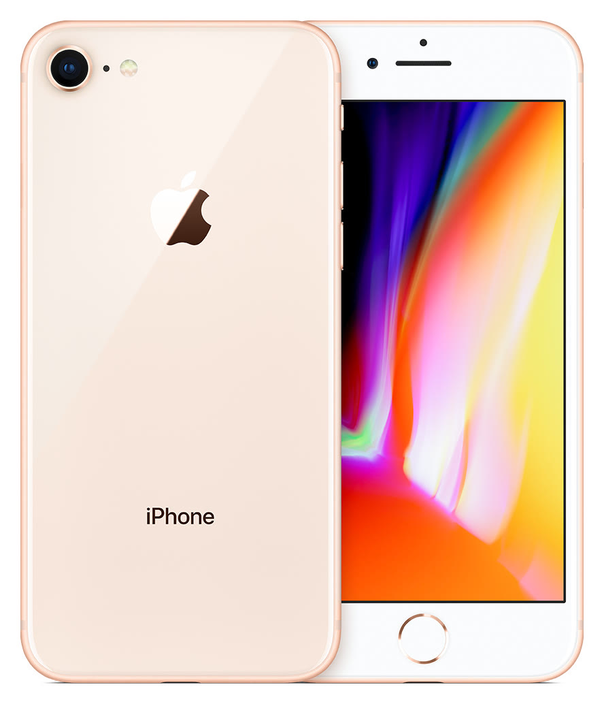

# iPhone 8

**Model id:** `iphone-8` · **Released:** 2017 · **Generation:** 2017

> Phase 1 research output. Every row cites a source or is explicitly flagged as
> unverified. Nothing here may be transcribed into `src/data/` without its flag
> being read first (SPEC.md §10, D-11).

## Body

| Fact    | Value                                                                      | Source |
| ------- | -------------------------------------------------------------------------- | ------ |
| Height  | 138.4 mm                                                                   | S1     |
| Width   | 67.3 mm                                                                    | S1     |
| Depth   | 7.3 mm                                                                     | S1     |
| Weight  | 148 grams                                                                  | S1     |
| Display | 4.7-inch (diagonal) widescreen LCD Multi-Touch display with IPS technology | S1     |

## Coarse-tier attributes (SPEC.md §6.1)

| Attribute            | Value(s)                                  | Confidence  | Source | Note                                                                                                                                                                                                                                                     |
| -------------------- | ----------------------------------------- | ----------- | ------ | -------------------------------------------------------------------------------------------------------------------------------------------------------------------------------------------------------------------------------------------------------- |
| `home_button`        | `present`                                 | ✅ verified | S1     | Home button with Touch ID.                                                                                                                                                                                                                               |
| `port`               | `lightning`                               | ✅ verified | S1     | Listed under External Buttons and Connectors.                                                                                                                                                                                                            |
| `rear_camera_count`  | `1`                                       | ✅ verified | S1     |                                                                                                                                                                                                                                                          |
| `rear_camera_layout` | `single_lens_flash_below`                 | 🟡 inferred | —      | One circular lens in a small raised ring at the top left, with the flash as a separate circle directly **below** it. No square housing. **Arrangement described from the researcher's reading, not a cited source — confirm against a reference image.** |
| `front_cutout`       | `bezels_no_cutout`                        | ✅ verified | S3     | Top and bottom bezels, round Home button, no display cutout.                                                                                                                                                                                             |
| `body_size_class`    | `compact`                                 | ✅ verified | S1     | Derived from body height 138.4 mm against the bands in SPEC.md §6.3. An adjacent class is added only when a model actually in that class sits within 3 mm — see SPEC.md §6.3.                                                                            |
| `sim_tray`           | `right_side`                              | ✅ verified | S2     | SIM tray on the right side, below the side button. Present in all markets.                                                                                                                                                                               |
| `colour`             | `gold` · `white_silver` · `black` · `red` | 🟡 inferred | S1     | Marketing names are Apple's; the descriptive mapping is this project's (see `reference/palette.md`).                                                                                                                                                     |

## Deep-tier attributes (SPEC.md §6.2)

| Attribute                 | Value                  | Confidence        | Source | Note                                                                                                                                                                                 |
| ------------------------- | ---------------------- | ----------------- | ------ | ------------------------------------------------------------------------------------------------------------------------------------------------------------------------------------ |
| `action_button`           | `absent`               | ✅ verified       | S1     | Ring/Silent switch fitted instead.                                                                                                                                                   |
| `camera_control_button`   | `absent`               | ✅ verified       | S1     |                                                                                                                                                                                      |
| `magsafe`                 | `absent`               | ✅ verified       | S1     | No MagSafe. Apple's tech specs list Qi wireless charging with no magnet array; MagSafe did not exist before the iPhone 12.                                                           |
| `frame_material_finish`   | `aluminium_matte`      | 🟡 inferred       | S3     | Anodised aluminium, matte.                                                                                                                                                           |
| `back_glass_finish`       | `glossy`               | 🟡 inferred       | S3     | Glossy glass.                                                                                                                                                                        |
| `rear_wordmark`           | `iphone_text_present`  | ✅ verified       | S5     | Apple logo in the upper third with the word "iPhone" below it. Regulatory text below that varies by region.                                                                          |
| `bottom_mic_hole_pattern` | — (not researched)     | 🔴 unverified     | —      | Only researched where it discriminates (iPhone X vs XS).                                                                                                                             |
| `camera_bump_size`        | —                      | ⚪ not applicable | —      | Not applicable. The value is relative to a `rear_camera_layout` family (SPEC.md §6.2) and this model is outside the diagonal-dual family, so there is nothing to compare it against. |
| `flash_position`          | `beside_lens_on_glass` | ✅ verified       | —      | To the right of the lens on the bare glass, level with it, past the mic hole. Read off the committed product shot at enlargement.                                                    |
| `lidar`                   | `absent`               | ✅ verified       | S1     |                                                                                                                                                                                      |

## Colours (SPEC.md §6.5)

| Descriptive value | Apple marketing name | Note |
| ----------------- | -------------------- | ---- |
| `gold`            | Gold                 |      |
| `white_silver`    | Silver               |      |
| `black`           | Space Gray           |      |
| `red`             | (PRODUCT) RED        |      |

All marketing names from S1. Descriptive values per `reference/palette.md`.

## Cautions

- Same body as both SE generations. The separating detail is the rear: the iPhone 8 carries the "iPhone" wordmark with the logo higher up; the SE models have a centred logo and no wordmark.
- Colour can be wrong on a rehoused phone or one with replaced back glass (SPEC.md §6.4). Treat a colour answer as evidence, not proof.

## Sources

- **S1** — Apple — iPhone 8 Tech Specs — <https://support.apple.com/en-us/111976> (fetched 2026-08-19)
- **S2** — Apple — Remove or switch the SIM card in your iPhone — <https://support.apple.com/en-us/109357> (fetched 2026-08-19)
- **S3** — Wikipedia — iPhone 8 — <https://en.wikipedia.org/wiki/IPhone_8> (fetched 2026-08-19)
- **S4** — Apple product image, committed as reference/images/apple/iphone-8.jpg — <https://store.storeimages.cdn-apple.com/4982/as-images.apple.com/is/iphone8-gold-select-2017?wid=1800&hei=1800&fmt=jpeg&qlt=95> (fetched 2026-08-19)
- **S5** — The Apple Post — Apple to remove the word "iPhone" from the back of the 2019 models — <https://www.theapplepost.com/2019/08/16/34120/apple-to-remove-word-iphone-from-back-of-the-2019-models-according-to-so-called-factory-worker/> (fetched 2026-08-19)

## Reference images

`reference/images/apple/iphone-8.jpg` — Apple's own product shot: one device, back and
front, straight on and unobstructed at 888x1034. From <https://store.storeimages.cdn-apple.com/4982/as-images.apple.com/is/iphone8-gold-select-2017?wid=1800&hei=1800&fmt=jpeg&qlt=95>
(downloaded 2026-08-19).

Not captured for this model: the bottom edge (port and mic/speaker hole pattern)
and the side edges. See `reference/images/README.md`.
