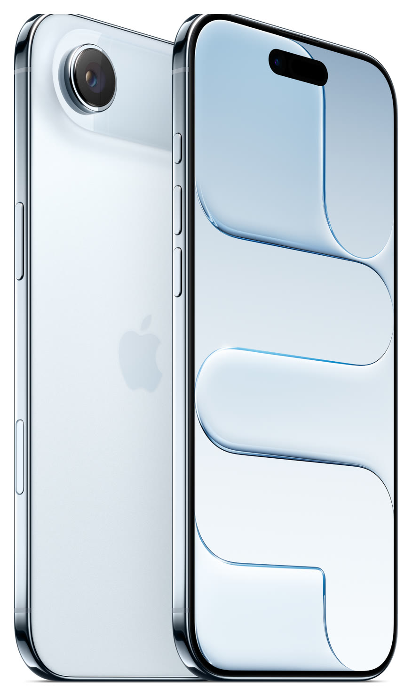

# iPhone Air

**Model id:** `iphone-air` · **Released:** 2025 · **Generation:** 2025

> Phase 1 research output. Every row cites a source or is explicitly flagged as
> unverified. Nothing here may be transcribed into `src/data/` without its flag
> being read first (SPEC.md §10, D-11).

## Body

| Fact                         | Value                                                        | Source |
| ---------------------------- | ------------------------------------------------------------ | ------ |
| Height                       | 156.2 mm                                                     | S1     |
| Width                        | 74.7 mm                                                      | S1     |
| Depth                        | 5.64 mm                                                      | S1     |
| Weight                       | 165 grams                                                    | S1     |
| Display                      | 6.5‑inch (diagonal) all‑screen OLED display                  | S1     |
| Apple's material description | Titanium design, Ceramic Shield 2 front, Ceramic Shield back | S1     |

## Coarse-tier attributes (SPEC.md §6.1)

| Attribute            | Value(s)                                         | Confidence  | Source | Note                                                                                                                                                                          |
| -------------------- | ------------------------------------------------ | ----------- | ------ | ----------------------------------------------------------------------------------------------------------------------------------------------------------------------------- |
| `home_button`        | `absent`                                         | ✅ verified | S1     | No home button; Face ID.                                                                                                                                                      |
| `port`               | `usb_c`                                          | ✅ verified | S1     | Listed under External Buttons and Connectors.                                                                                                                                 |
| `rear_camera_count`  | `1`                                              | ✅ verified | S1     |                                                                                                                                                                               |
| `rear_camera_layout` | `plateau_oval_single`                            | ✅ verified | S3     | A single lens in an elevated **oval plateau** across the top of the back.                                                                                                     |
| `front_cutout`       | `dynamic_island`                                 | ✅ verified | S1     | Pill-shaped Dynamic Island cutout, detached from the top edge.                                                                                                                |
| `body_size_class`    | `max`                                            | ✅ verified | S1     | Derived from body height 156.2 mm against the bands in SPEC.md §6.3. An adjacent class is added only when a model actually in that class sits within 3 mm — see SPEC.md §6.3. |
| `sim_tray`           | `none`                                           | ✅ verified | S2     | eSIM only worldwide. iPhone Air appears on neither of Apple's SIM-tray lists, and Apple states it is sold without physical SIM support in every market.                       |
| `colour`             | `black` · `white_silver` · `gold` · `light_blue` | 🟡 inferred | S1     | Marketing names are Apple's; the descriptive mapping is this project's (see `reference/palette.md`).                                                                          |

## Deep-tier attributes (SPEC.md §6.2)

| Attribute                 | Value               | Confidence    | Source | Note                                                                                                                                                      |
| ------------------------- | ------------------- | ------------- | ------ | --------------------------------------------------------------------------------------------------------------------------------------------------------- |
| `action_button`           | `present`           | ✅ verified   | S1     | Replaces the ring/silent switch.                                                                                                                          |
| `camera_control_button`   | `present`           | ✅ verified   | S1     | Capacitive button on the lower right edge.                                                                                                                |
| `magsafe`                 | `present`           | ✅ verified   | S1     | Apple's tech specs state MagSafe wireless charging explicitly.                                                                                            |
| `frame_material_finish`   | `titanium_polished` | ✅ verified   | S1     | Titanium.                                                                                                                                                 |
| `back_glass_finish`       | `ceramic_shield`    | ✅ verified   | S1     | Ceramic Shield (not conventional glass).                                                                                                                  |
| `rear_wordmark`           | `logo_only_centred` | 🟡 inferred   | S5     | Apple logo centred, no "iPhone" wordmark. Cited source covers the 2019 change; continuation to this model is assumed — confirm against a reference image. |
| `bottom_mic_hole_pattern` | `asymmetric`        | 🟡 inferred   | —      | Asymmetric, as on every model after the iPhone X. Only useful for the X/XS pair.                                                                          |
| `camera_bump_size`        | — (n/a)             | 🔴 unverified | —      | Not a discriminator for this model.                                                                                                                       |
| `flash_position`          | `in_plateau`        | 🔴 unverified | —      | Inside the plateau. **Not read off the image yet — confirm against the committed reference image before transcribing.**                                   |
| `lidar`                   | `absent`            | ✅ verified   | S1     |                                                                                                                                                           |

## Colours (SPEC.md §6.5)

| Descriptive value | Apple marketing name | Note |
| ----------------- | -------------------- | ---- |
| `black`           | Space Black          |      |
| `white_silver`    | Cloud White          |      |
| `gold`            | Light Gold           |      |
| `light_blue`      | Sky Blue             |      |

All marketing names from S1. Descriptive values per `reference/palette.md`.

## Cautions

- This model introduced `ceramic_shield` back to the SPEC.md §6.2 taxonomy, which was extended to cover them.
- Colour can be wrong on a rehoused phone or one with replaced back glass (SPEC.md §6.4). Treat a colour answer as evidence, not proof.

## Sources

- **S1** — Apple — iPhone Air Tech Specs — <https://support.apple.com/en-us/125092> (fetched 2026-08-19)
- **S2** — Apple — Remove or switch the SIM card in your iPhone — <https://support.apple.com/en-us/109357> (fetched 2026-08-19)
- **S3** — Wikipedia — iPhone Air — <https://en.wikipedia.org/wiki/IPhone_Air> (fetched 2026-08-19)
- **S4** — Apple product image, committed as reference/images/apple/iphone-air.jpg — <https://store.storeimages.cdn-apple.com/4982/as-images.apple.com/is/iphone-air-finish-select-spaceblack-202509?wid=1800&hei=1800&fmt=jpeg&qlt=95> (fetched 2026-08-19)
- **S5** — 9to5Mac — Cases show iPhone 11 design, including new position of Apple logo — <https://9to5mac.com/2019/09/08/purported-iphone-11-cases-show-new-position-for-apple-logo-on-iphone-11-back/> (fetched 2026-08-19)

## Reference images

`reference/images/apple/iphone-air.jpg` — Apple's own product shot: one device, back and
front, straight on and unobstructed at 876x1484. From <https://store.storeimages.cdn-apple.com/4982/as-images.apple.com/is/iphone-air-finish-select-spaceblack-202509?wid=1800&hei=1800&fmt=jpeg&qlt=95>
(downloaded 2026-08-19).

Not captured for this model: the bottom edge (port and mic/speaker hole pattern)
and the side edges. See `reference/images/README.md`.
