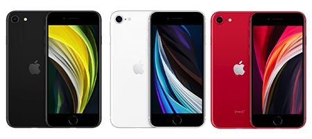

# iPhone SE (2nd generation)

**Model id:** `iphone-se-2` · **Released:** 2020 · **Generation:** 2020

> Phase 1 research output. Every row cites a source or is explicitly flagged as
> unverified. Nothing here may be transcribed into `src/data/` without its flag
> being read first (SPEC.md §10, D-11).

## Body

| Fact | Value | Source |
|---|---|---|
| Height | 138.4 mm | S1 |
| Width | 67.3 mm | S1 |
| Depth | 7.3 mm | S1 |
| Weight | 148 grams | S1 |
| Display | 4.7-inch (diagonal) widescreen LCD Multi‑Touch display with IPS technology | S1 |

## Coarse-tier attributes (SPEC.md §6.1)

| Attribute | Value(s) | Confidence | Source | Note |
|---|---|---|---|---|
| `home_button` | `present` | ✅ verified | S1 | Home button with Touch ID. |
| `port` | `lightning` | ✅ verified | S1 | Listed under External Buttons and Connectors. |
| `rear_camera_count` | `1` | ✅ verified | S1 | |
| `rear_camera_layout` | `single_lens_flash_below` | 🟡 inferred | — | One circular lens in a small raised ring at the top left, with the flash as a separate circle directly **below** it. No square housing. **Arrangement described from the researcher's reading, not a cited source — confirm against a reference image.** |
| `front_cutout` | `bezels_no_cutout` | ✅ verified | S3 | Top and bottom bezels, round Home button, no display cutout. |
| `body_size_class` | `compact` | ✅ verified | S1 | Derived from body height 138.4 mm against the bands in SPEC.md §6.3. An adjacent class is added only when a model actually in that class sits within 3 mm — see reference/findings.md §5. |
| `sim_tray` | `right_side` | ✅ verified | S2 | SIM tray on the right side, below the side button. Present in all markets. |
| `colour` | `black` · `white_silver` · `red` | 🟡 inferred | S1 | Marketing names are Apple's; the descriptive mapping is this project's (see `reference/palette.md`). |

## Deep-tier attributes (SPEC.md §6.2)

| Attribute | Value | Confidence | Source | Note |
|---|---|---|---|---|
| `action_button` | `absent` | ✅ verified | S1 | Ring/Silent switch fitted instead. |
| `camera_control_button` | `absent` | ✅ verified | S1 |  |
| `frame_material_finish` | `aluminium_matte` | 🟡 inferred | S3 | Anodised aluminium, matte. |
| `back_glass_finish` | `glossy` | 🟡 inferred | S3 | Glossy glass. |
| `rear_wordmark` | `logo_only_centred` | ✅ verified | S3 | Apple logo centred, no "iPhone" wordmark. |
| `bottom_mic_hole_pattern` | — (not researched) | 🔴 unverified | — | Only researched where it discriminates (iPhone X vs XS). |
| `camera_bump_size` | — (n/a) | 🔴 unverified | — | Not a discriminator for this model. |
| `flash_position` | `below_lens` | 🔴 unverified | — | Directly below the lens. **Not read off the image yet — confirm against the committed reference image before transcribing.** |
| `lidar` | `absent` | ✅ verified | S1 |  |

## Colours (SPEC.md §6.5)

| Descriptive value | Apple marketing name | Note |
|---|---|---|
| `black` | Black |  |
| `white_silver` | White |  |
| `red` | (PRODUCT) RED |  |

All marketing names from S1. Descriptive values per `reference/palette.md`.

## Cautions

- iPhone SE (2nd generation) and iPhone SE (3rd generation) are externally identical. This is a documented terminal group (SPEC.md §4.4) — do not expect any visible attribute to separate them.
- Colour can be wrong on a rehoused phone or one with replaced back glass (SPEC.md §6.4). Treat a colour answer as evidence, not proof.

## Sources

- **S1** — Apple — iPhone SE (2nd generation) Tech Specs — <https://support.apple.com/en-us/111882> (fetched 2026-08-19)
- **S2** — Apple — Remove or switch the SIM card in your iPhone — <https://support.apple.com/en-us/109357> (fetched 2026-08-19)
- **S3** — Wikipedia — iPhone SE (2nd generation) — <https://en.wikipedia.org/wiki/IPhone_SE_(2nd_generation)> (fetched 2026-08-19)
- **S4** — Apple product image, committed as reference/images/iphone-se-2.png — <https://cdsassets.apple.com/live/SZLF0YNV/images/sp/111882_iphone-se-2nd-gen.png> (fetched 2026-08-19)

## Reference images

`reference/images/iphone-se-2.png` — official Apple product image, from <https://cdsassets.apple.com/live/SZLF0YNV/images/sp/111882_iphone-se-2nd-gen.png> (downloaded 2026-08-19). Shows the rear in every finish plus the front.

Not yet captured for this model: bottom edge (port and mic/speaker hole pattern) and the side edges. See `reference/images/README.md`.
