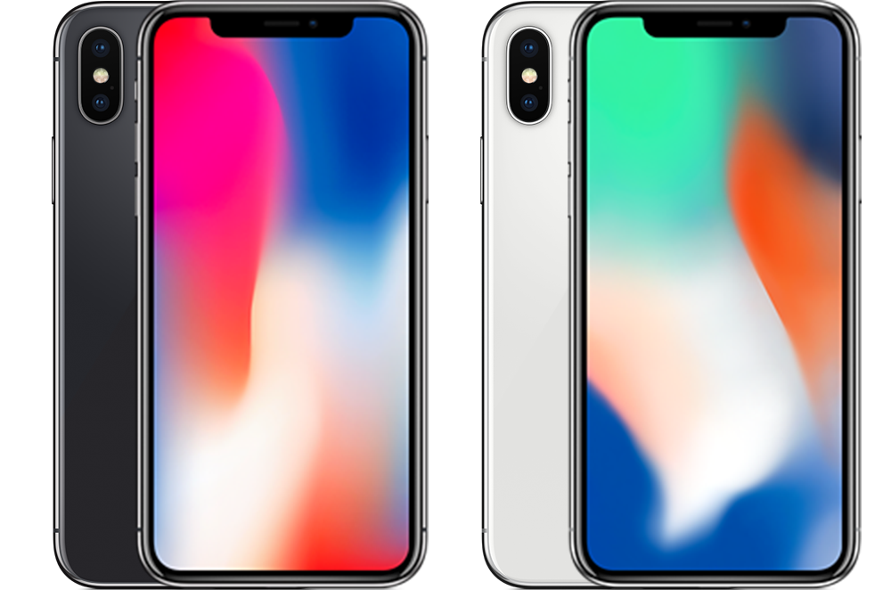

# iPhone X

**Model id:** `iphone-x` · **Released:** 2017 · **Generation:** 2017

> Phase 1 research output. Every row cites a source or is explicitly flagged as
> unverified. Nothing here may be transcribed into `src/data/` without its flag
> being read first (SPEC.md §10, D-11).

## Body

| Fact | Value | Source |
|---|---|---|
| Height | 143.6 mm | S1 |
| Width | 70.9 mm | S1 |
| Depth | 7.7 mm | S1 |
| Weight | 174 grams | S1 |
| Display | 5.8-inch (diagonal) all-screen OLED Multi-Touch display | S1 |

## Coarse-tier attributes (SPEC.md §6.1)

| Attribute | Value(s) | Confidence | Source | Note |
|---|---|---|---|---|
| `home_button` | `absent` | ✅ verified | S1 | No home button; Face ID. |
| `port` | `lightning` | ✅ verified | S1 | Listed under External Buttons and Connectors. |
| `rear_camera_count` | `2` | ✅ verified | S1 | |
| `rear_camera_layout` | `dual_vertical_pill` | 🟡 inferred | — | Two lenses stacked **vertically** in one raised pill at the top left, flash between them. **Arrangement described from the researcher's reading, not a cited source — confirm against a reference image.** |
| `front_cutout` | `notch_wide` | ✅ verified | S3 | Wide notch (~35 mm) at the top of an all-screen display. |
| `body_size_class` | `standard` | ✅ verified | S1 | Derived from body height 143.6 mm against the bands in SPEC.md §6.3. An adjacent class is added only when a model actually in that class sits within 3 mm — see reference/findings.md §5. |
| `sim_tray` | `right_side` | ✅ verified | S2 | SIM tray on the right side, below the side button. Present in all markets. |
| `colour` | `black` · `white_silver` | 🟡 inferred | S1 | Marketing names are Apple's; the descriptive mapping is this project's (see `reference/palette.md`). |

## Deep-tier attributes (SPEC.md §6.2)

| Attribute | Value | Confidence | Source | Note |
|---|---|---|---|---|
| `action_button` | `absent` | ✅ verified | S1 | Ring/Silent switch fitted instead. |
| `camera_control_button` | `absent` | ✅ verified | S1 |  |
| `frame_material_finish` | `stainless_glossy` | 🟡 inferred | S3 | Polished stainless steel. |
| `back_glass_finish` | `glossy` | 🟡 inferred | S3 | Glossy glass. |
| `rear_wordmark` | `iphone_text_present` | ✅ verified | S5 | Apple logo in the upper third with the word "iPhone" below it. Regulatory text below that varies by region. |
| `bottom_mic_hole_pattern` | `symmetric_six_six` | ✅ verified | S6 | Equal hole counts either side of the port — the iPhone X tell. |
| `camera_bump_size` | — (n/a) | 🔴 unverified | — | Not a discriminator for this model. |
| `flash_position` | `between_lenses` | ✅ verified | S4 | Between the two lenses, offset right. Read off the committed reference image during Phase 1. |
| `lidar` | `absent` | ✅ verified | S1 |  |

## Colours (SPEC.md §6.5)

| Descriptive value | Apple marketing name | Note |
|---|---|---|
| `black` | Space Gray |  |
| `white_silver` | Silver |  |

All marketing names from S1. Descriptive values per `reference/palette.md`.

## Cautions

- Near-identical to the iPhone XS. Tells: bottom hole pattern (symmetric on the X), no gold finish on the X, and the X has no lower-edge antenna line.
- Colour can be wrong on a rehoused phone or one with replaced back glass (SPEC.md §6.4). Treat a colour answer as evidence, not proof.

## Sources

- **S1** — Apple — iPhone X Tech Specs — <https://support.apple.com/en-us/111864> (fetched 2026-08-19)
- **S2** — Apple — Remove or switch the SIM card in your iPhone — <https://support.apple.com/en-us/109357> (fetched 2026-08-19)
- **S3** — Wikipedia — iPhone X — <https://en.wikipedia.org/wiki/IPhone_X> (fetched 2026-08-19)
- **S4** — Apple product image, committed as reference/images/iphone-x.png — <https://cdsassets.apple.com/live/SZLF0YNV/images/sp/111864_iphonex.png> (fetched 2026-08-19)
- **S5** — The Apple Post — Apple to remove the word "iPhone" from the back of the 2019 models — <https://www.theapplepost.com/2019/08/16/34120/apple-to-remove-word-iphone-from-back-of-the-2019-models-according-to-so-called-factory-worker/> (fetched 2026-08-19)
- **S6** — iFixit Answers — How to tell iPhone X apart from XS? — <https://www.ifixit.com/Answers/View/589322/How+to+tell+iPhone+X+apart+from+XS> (fetched 2026-08-19)

## Reference images

`reference/images/iphone-x.png` — official Apple product image, from <https://cdsassets.apple.com/live/SZLF0YNV/images/sp/111864_iphonex.png> (downloaded 2026-08-19). Shows the rear in every finish plus the front.

Not yet captured for this model: bottom edge (port and mic/speaker hole pattern) and the side edges. See `reference/images/README.md`.
