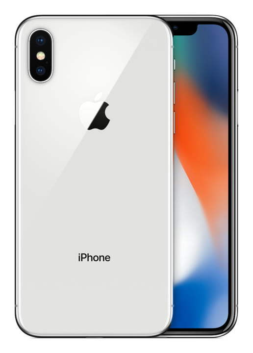
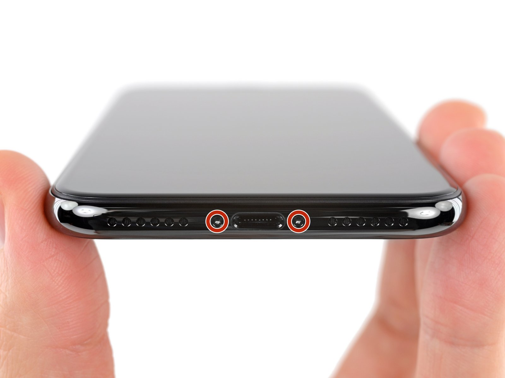

# iPhone X

**Model id:** `iphone-x` · **Released:** 2017 · **Generation:** 2017

> Phase 1 research output. Every row cites a source or is explicitly flagged as
> unverified. Nothing here may be transcribed into `src/data/` without its flag
> being read first (SPEC.md §10, D-11).

## Body

| Fact    | Value                                                   | Source |
| ------- | ------------------------------------------------------- | ------ |
| Height  | 143.6 mm                                                | S1     |
| Width   | 70.9 mm                                                 | S1     |
| Depth   | 7.7 mm                                                  | S1     |
| Weight  | 174 grams                                               | S1     |
| Display | 5.8-inch (diagonal) all-screen OLED Multi-Touch display | S1     |

## Coarse-tier attributes (SPEC.md §6.1)

| Attribute            | Value(s)                 | Confidence  | Source | Note                                                                                                                                                                                                       |
| -------------------- | ------------------------ | ----------- | ------ | ---------------------------------------------------------------------------------------------------------------------------------------------------------------------------------------------------------- |
| `home_button`        | `absent`                 | ✅ verified | S1     | No home button; Face ID.                                                                                                                                                                                   |
| `port`               | `lightning`              | ✅ verified | S1     | Listed under External Buttons and Connectors.                                                                                                                                                              |
| `rear_camera_count`  | `2`                      | ✅ verified | S1     |                                                                                                                                                                                                            |
| `rear_camera_layout` | `dual_vertical_pill`     | 🟡 inferred | —      | Two lenses stacked **vertically** in one raised pill at the top left, flash between them. **Arrangement described from the researcher's reading, not a cited source — confirm against a reference image.** |
| `front_cutout`       | `notch_wide`             | ✅ verified | S3     | Wide notch (~35 mm) at the top of an all-screen display.                                                                                                                                                   |
| `body_size_class`    | `standard`               | ✅ verified | S1     | Derived from body height 143.6 mm against the bands in SPEC.md §6.3. An adjacent class is added only when a model actually in that class sits within 3 mm — see SPEC.md §6.3.                              |
| `sim_tray`           | `right_side`             | ✅ verified | S2     | SIM tray on the right side, below the side button. Present in all markets.                                                                                                                                 |
| `colour`             | `black` · `white_silver` | 🟡 inferred | S1     | Marketing names are Apple's; the descriptive mapping is this project's (see `reference/palette.md`).                                                                                                       |

## Deep-tier attributes (SPEC.md §6.2)

| Attribute                 | Value                 | Confidence        | Source | Note                                                                                                                                                                                 |
| ------------------------- | --------------------- | ----------------- | ------ | ------------------------------------------------------------------------------------------------------------------------------------------------------------------------------------ |
| `action_button`           | `absent`              | ✅ verified       | S1     | Ring/Silent switch fitted instead.                                                                                                                                                   |
| `camera_control_button`   | `absent`              | ✅ verified       | S1     |                                                                                                                                                                                      |
| `magsafe`                 | `absent`              | ✅ verified       | S1     | No MagSafe. Apple's tech specs list Qi wireless charging with no magnet array; MagSafe did not exist before the iPhone 12.                                                           |
| `frame_material_finish`   | `stainless_glossy`    | 🟡 inferred       | S3     | Polished stainless steel.                                                                                                                                                            |
| `back_glass_finish`       | `glossy`              | 🟡 inferred       | S3     | Glossy glass.                                                                                                                                                                        |
| `rear_wordmark`           | `iphone_text_present` | ✅ verified       | S5     | Apple logo in the upper third with the word "iPhone" below it. Regulatory text below that varies by region.                                                                          |
| `bottom_mic_hole_pattern` | `symmetric_six_six`   | ✅ verified       | S6, S7 | Equal hole counts either side of the port — the iPhone X tell. Photographed: see the committed bottom-edge image.                                                                    |
| `camera_bump_size`        | —                     | ⚪ not applicable | —      | Not applicable. The value is relative to a `rear_camera_layout` family (SPEC.md §6.2) and this model is outside the diagonal-dual family, so there is nothing to compare it against. |
| `flash_position`          | `between_lenses`      | ✅ verified       | S4     | Between the two lenses, offset right. Read off the committed reference image, and re-checked against the clean product shot.                                                         |
| `lidar`                   | `absent`              | ✅ verified       | S1     |                                                                                                                                                                                      |

## Colours (SPEC.md §6.5)

| Descriptive value | Apple marketing name | Note |
| ----------------- | -------------------- | ---- |
| `black`           | Space Gray           |      |
| `white_silver`    | Silver               |      |

All marketing names from S1. Descriptive values per `reference/palette.md`.

## Cautions

- Near-identical to the iPhone XS. Tells: bottom hole pattern (symmetric on the X), no gold finish on the X, and the X has no lower-edge antenna line.
- Colour can be wrong on a rehoused phone or one with replaced back glass (SPEC.md §6.4). Treat a colour answer as evidence, not proof.

## Sources

- **S1** — Apple — iPhone X Tech Specs — <https://support.apple.com/en-us/111864> (fetched 2026-08-19)
- **S2** — Apple — Remove or switch the SIM card in your iPhone — <https://support.apple.com/en-us/109357> (fetched 2026-08-19)
- **S3** — Wikipedia — iPhone X — <https://en.wikipedia.org/wiki/IPhone_X> (fetched 2026-08-19)
- **S4** — Apple product image, committed as reference/images/apple/iphone-x.jpg — <https://store.storeimages.cdn-apple.com/4982/as-images.apple.com/is/iphone-x-silver-select-2017?wid=1800&hei=1800&fmt=jpeg&qlt=95> (fetched 2026-08-19)
- **S5** — The Apple Post — Apple to remove the word "iPhone" from the back of the 2019 models — <https://www.theapplepost.com/2019/08/16/34120/apple-to-remove-word-iphone-from-back-of-the-2019-models-according-to-so-called-factory-worker/> (fetched 2026-08-19)
- **S6** — iFixit Answers — How to tell iPhone X apart from XS? — <https://www.ifixit.com/Answers/View/589322/How+to+tell+iPhone+X+apart+from+XS> (fetched 2026-08-19)
- **S7** — iFixit — iPhone X Pentalobe Screws Replacement — <https://www.ifixit.com/Guide/iPhone+X+Pentalobe+Screws+Replacement/101649> (fetched 2026-08-19); guide hero image committed as reference/images/ifixit/iphone-x/bottom-edge-03.jpg

## Reference images

`reference/images/apple/iphone-x.jpg` — Apple's own product shot: one device, back and
front, straight on and unobstructed at 516x720. From <https://store.storeimages.cdn-apple.com/4982/as-images.apple.com/is/iphone-x-silver-select-2017?wid=1800&hei=1800&fmt=jpeg&qlt=95>
(downloaded 2026-08-19).

### Bottom edge

`reference/images/ifixit/iphone-x/bottom-edge-03.jpg` — Six holes either side of the Lightning port. This is the direct evidence for
`bottom_mic_hole_pattern`, which until now rested on a forum answer. From iFixit's
[iPhone X Pentalobe Screws Replacement](https://www.ifixit.com/Guide/iPhone+X+Pentalobe+Screws+Replacement/101649) (downloaded 2026-08-19).
