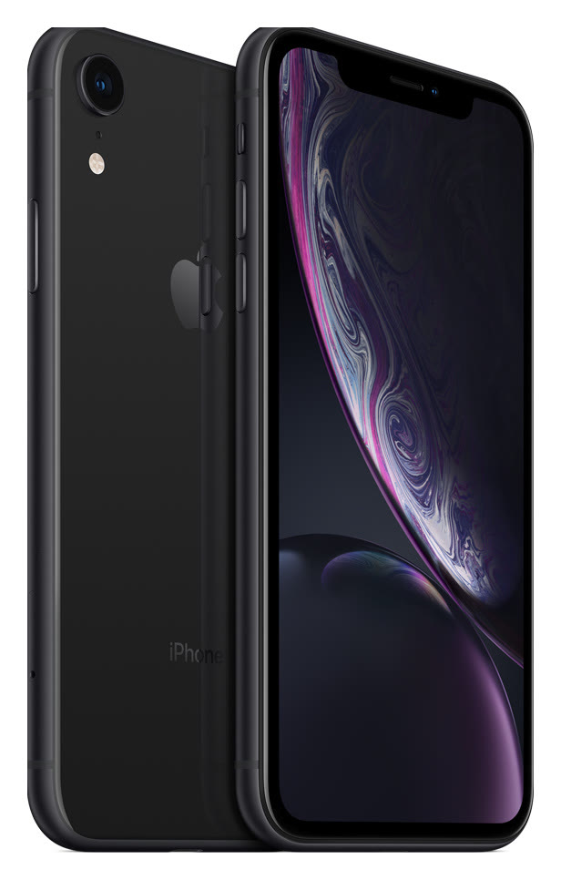

# iPhone XR

**Model id:** `iphone-xr` · **Released:** 2018 · **Generation:** 2018

> Phase 1 research output. Every row cites a source or is explicitly flagged as
> unverified. Nothing here may be transcribed into `src/data/` without its flag
> being read first (SPEC.md §10, D-11).

## Body

| Fact    | Value                                                                      | Source |
| ------- | -------------------------------------------------------------------------- | ------ |
| Height  | 150.9 mm                                                                   | S1     |
| Width   | 75.7 mm                                                                    | S1     |
| Depth   | 8.3 mm                                                                     | S1     |
| Weight  | 194 grams                                                                  | S1     |
| Display | 6.1-inch (diagonal) all-screen LCD Multi-Touch display with IPS technology | S1     |

## Coarse-tier attributes (SPEC.md §6.1)

| Attribute            | Value(s)                                                             | Confidence  | Source | Note                                                                                                                                                                                                                              |
| -------------------- | -------------------------------------------------------------------- | ----------- | ------ | --------------------------------------------------------------------------------------------------------------------------------------------------------------------------------------------------------------------------------- |
| `home_button`        | `absent`                                                             | ✅ verified | S1     | No home button; Face ID.                                                                                                                                                                                                          |
| `port`               | `lightning`                                                          | ✅ verified | S1     | Listed under External Buttons and Connectors.                                                                                                                                                                                     |
| `rear_camera_count`  | `1`                                                                  | ✅ verified | S1     |                                                                                                                                                                                                                                   |
| `rear_camera_layout` | `single_lens_in_pill`                                                | 🟡 inferred | —      | One circular lens with the flash below it, both inside a single vertically-oriented raised pill at the top left. **Arrangement described from the researcher's reading, not a cited source — confirm against a reference image.** |
| `front_cutout`       | `notch_wide`                                                         | ✅ verified | S3     | Wide notch (~35 mm) at the top of an all-screen display.                                                                                                                                                                          |
| `body_size_class`    | `standard`                                                           | ✅ verified | S1     | Derived from body height 150.9 mm against the bands in SPEC.md §6.3. The three bands sit in the gaps between the clusters the bodies form, and every model carries exactly one class (SPEC.md §6.3, D-27, D-28).                  |
| `sim_tray`           | `right_side`                                                         | ✅ verified | S2     | SIM tray on the right side, below the side button. Present in all markets.                                                                                                                                                        |
| `colour`             | `red` · `yellow` · `white_silver` · `coral` · `black` · `light_blue` | 🟡 inferred | S1     | Marketing names are Apple's; the descriptive mapping is this project's (see `reference/palette.md`).                                                                                                                              |

## Deep-tier attributes (SPEC.md §6.2)

| Attribute                 | Value                           | Confidence        | Source | Note                                                                                                                                                                                                                                                                                                                                                                                                                                 |
| ------------------------- | ------------------------------- | ----------------- | ------ | ------------------------------------------------------------------------------------------------------------------------------------------------------------------------------------------------------------------------------------------------------------------------------------------------------------------------------------------------------------------------------------------------------------------------------------ |
| `action_button`           | `absent`                        | ✅ verified       | S1     | Ring/Silent switch fitted instead.                                                                                                                                                                                                                                                                                                                                                                                                   |
| `camera_control_button`   | `absent`                        | ✅ verified       | S1     |                                                                                                                                                                                                                                                                                                                                                                                                                                      |
| `magsafe`                 | `absent`                        | ✅ verified       | S1     | No MagSafe. Apple's tech specs list Qi wireless charging with no magnet array; MagSafe did not exist before the iPhone 12.                                                                                                                                                                                                                                                                                                           |
| `frame_material_finish`   | `aluminium_glossy`              | 🟡 inferred       | S3     | Anodised aluminium, glossy/polished.                                                                                                                                                                                                                                                                                                                                                                                                 |
| `back_glass_finish`       | `glossy`                        | 🟡 inferred       | S3     | Glossy glass.                                                                                                                                                                                                                                                                                                                                                                                                                        |
| `rear_wordmark`           | `iphone_text_present`           | ✅ verified       | S5     | Apple logo in the upper third with the word "iPhone" below it. Regulatory text below that varies by region.                                                                                                                                                                                                                                                                                                                          |
| `bottom_mic_hole_pattern` | — (generalisation, not counted) | 🔴 unverified     | —      | Recorded as `asymmetric` in Phase 1 by generalisation from the iPhone X onward — no source consulted, no holes counted on this model. Downgraded from 🟡 in Phase 2: the catch-all is a **superset** of the specific counts, so under the SPEC.md §5.4 matching rule a technician who truthfully counts the holes on this phone eliminates it and lands on an iPhone X, XS or XS Max. Left absent instead, which eliminates nothing. |
| `camera_bump_size`        | —                               | ⚪ not applicable | —      | Not applicable. The value is relative to a `rear_camera_layout` family (SPEC.md §6.2) and this model is outside the diagonal-dual family, so there is nothing to compare it against.                                                                                                                                                                                                                                                 |
| `flash_position`          | `below_lens`                    | ✅ verified       | —      | Directly below the lens, past the mic hole. Read off the committed product shot at enlargement.                                                                                                                                                                                                                                                                                                                                      |
| `lidar`                   | `absent`                        | ✅ verified       | S1     |                                                                                                                                                                                                                                                                                                                                                                                                                                      |

## Colours (SPEC.md §6.5)

| Descriptive value | Apple marketing name | Note                                                                                           |
| ----------------- | -------------------- | ---------------------------------------------------------------------------------------------- |
| `red`             | (PRODUCT)RED         |                                                                                                |
| `yellow`          | Yellow               |                                                                                                |
| `white_silver`    | White                |                                                                                                |
| `coral`           | Coral                |                                                                                                |
| `black`           | Black                |                                                                                                |
| `light_blue`      | Blue                 | Shade resolved per model — Apple reuses this bare name across generations at different shades. |

All marketing names from S1. Descriptive values per `reference/palette.md`.

## Cautions

- Colour can be wrong on a rehoused phone or one with replaced back glass (SPEC.md §6.4). Treat a colour answer as evidence, not proof.

## Sources

- **S1** — Apple — iPhone XR Tech Specs — <https://support.apple.com/en-us/111868> (fetched 2026-08-19)
- **S2** — Apple — Remove or switch the SIM card in your iPhone — <https://support.apple.com/en-us/109357> (fetched 2026-08-19)
- **S3** — Wikipedia — iPhone XR — <https://en.wikipedia.org/wiki/IPhone_XR> (fetched 2026-08-19)
- **S4** — Apple product image, committed as reference/images/apple/iphone-xr.jpg — <https://store.storeimages.cdn-apple.com/4982/as-images.apple.com/is/iphone-xr-black-select-201809?wid=1800&hei=1800&fmt=jpeg&qlt=95> (fetched 2026-08-19)
- **S5** — The Apple Post — Apple to remove the word "iPhone" from the back of the 2019 models — <https://www.theapplepost.com/2019/08/16/34120/apple-to-remove-word-iphone-from-back-of-the-2019-models-according-to-so-called-factory-worker/> (fetched 2026-08-19)

## Reference images

`reference/images/apple/iphone-xr.jpg` — Apple's own product shot: one device, back and
front, straight on and unobstructed at 616x966. From <https://store.storeimages.cdn-apple.com/4982/as-images.apple.com/is/iphone-xr-black-select-201809?wid=1800&hei=1800&fmt=jpeg&qlt=95>
(downloaded 2026-08-19).

Not captured for this model: the bottom edge (port and mic/speaker hole pattern)
and the side edges. See `reference/images/README.md`.
