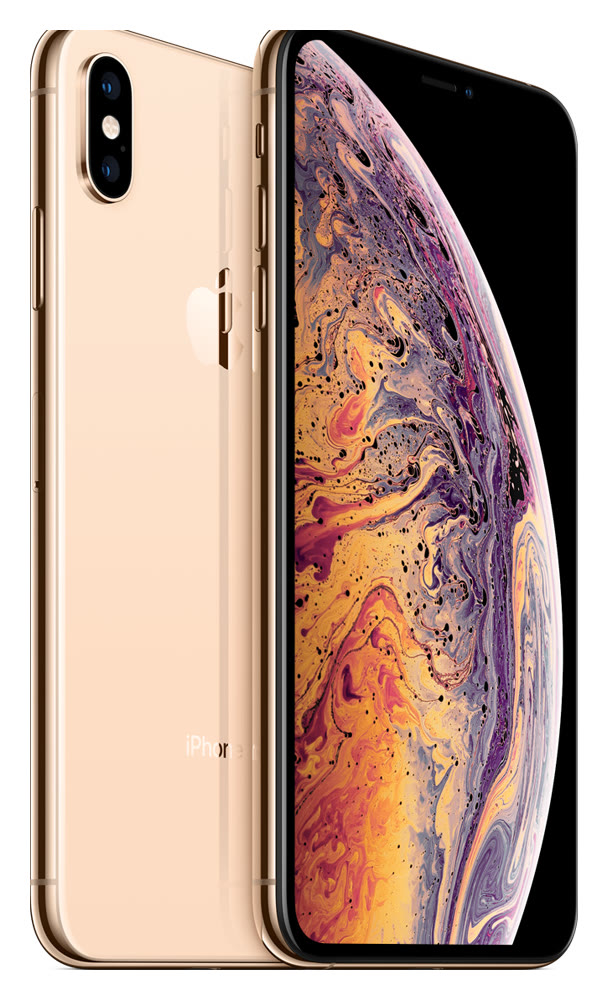
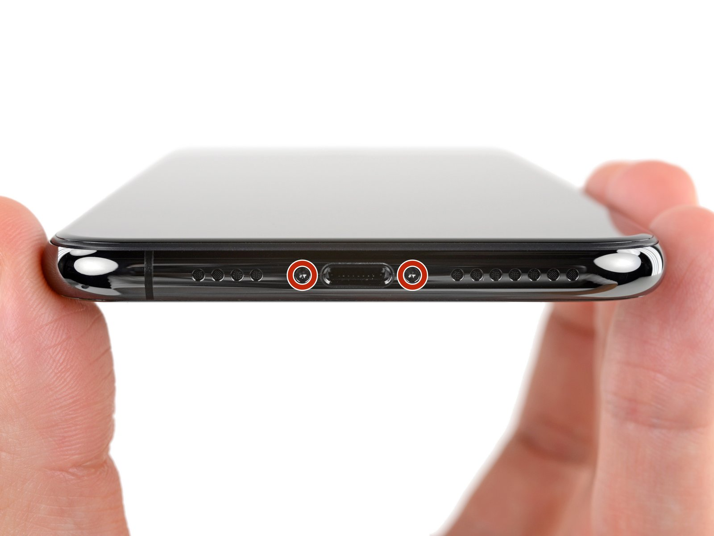

# iPhone XS Max

**Model id:** `iphone-xs-max` · **Released:** 2018 · **Generation:** 2018

> Phase 1 research output. Every row cites a source or is explicitly flagged as
> unverified. Nothing here may be transcribed into `src/data/` without its flag
> being read first (SPEC.md §10, D-11).

## Body

| Fact    | Value                                                   | Source |
| ------- | ------------------------------------------------------- | ------ |
| Height  | 157.5 mm                                                | S1     |
| Width   | 77.4 mm                                                 | S1     |
| Depth   | 7.7 mm                                                  | S1     |
| Weight  | 208 grams                                               | S1     |
| Display | 6.5‑inch (diagonal) all‑screen OLED Multi‑Touch display | S1     |

## Coarse-tier attributes (SPEC.md §6.1)

| Attribute            | Value(s)                          | Confidence  | Source | Note                                                                                                                                                                                                       |
| -------------------- | --------------------------------- | ----------- | ------ | ---------------------------------------------------------------------------------------------------------------------------------------------------------------------------------------------------------- |
| `home_button`        | `absent`                          | ✅ verified | S1     | No home button; Face ID.                                                                                                                                                                                   |
| `port`               | `lightning`                       | ✅ verified | S1     | Listed under External Buttons and Connectors.                                                                                                                                                              |
| `rear_camera_count`  | `2`                               | ✅ verified | S1     |                                                                                                                                                                                                            |
| `rear_camera_layout` | `dual_vertical_pill`              | 🟡 inferred | —      | Two lenses stacked **vertically** in one raised pill at the top left, flash between them. **Arrangement described from the researcher's reading, not a cited source — confirm against a reference image.** |
| `front_cutout`       | `notch_wide`                      | ✅ verified | S3     | Wide notch (~35 mm) at the top of an all-screen display.                                                                                                                                                   |
| `body_size_class`    | `max`                             | ✅ verified | S1     | Derived from body height 157.5 mm against the bands in SPEC.md §6.3. An adjacent class is added only when a model actually in that class sits within 3 mm — see SPEC.md §6.3.                              |
| `sim_tray`           | `right_side`                      | ✅ verified | S2     | SIM tray on the right side, below the side button. Present in all markets.                                                                                                                                 |
| `colour`             | `gold` · `black` · `white_silver` | 🟡 inferred | S1     | Marketing names are Apple's; the descriptive mapping is this project's (see `reference/palette.md`).                                                                                                       |

## Deep-tier attributes (SPEC.md §6.2)

| Attribute                 | Value                   | Confidence    | Source | Note                                                                                                                                                                                                                                                |
| ------------------------- | ----------------------- | ------------- | ------ | --------------------------------------------------------------------------------------------------------------------------------------------------------------------------------------------------------------------------------------------------- |
| `action_button`           | `absent`                | ✅ verified   | S1     | Ring/Silent switch fitted instead.                                                                                                                                                                                                                  |
| `camera_control_button`   | `absent`                | ✅ verified   | S1     |                                                                                                                                                                                                                                                     |
| `frame_material_finish`   | `stainless_glossy`      | 🟡 inferred   | S3     | Polished stainless steel.                                                                                                                                                                                                                           |
| `back_glass_finish`       | `glossy`                | 🟡 inferred   | S3     | Glossy glass.                                                                                                                                                                                                                                       |
| `rear_wordmark`           | `iphone_text_present`   | ✅ verified   | S5     | Apple logo in the upper third with the word "iPhone" below it. Regulatory text below that varies by region.                                                                                                                                         |
| `bottom_mic_hole_pattern` | `asymmetric_four_seven` | ✅ verified   | S7     | Four holes on the left (microphone), seven on the right (speaker) — **not** the three/six of the iPhone XS. Counted off the committed bottom-edge photograph. The forum answer at S6 describes the X versus the XS only and does not cover the Max. |
| `camera_bump_size`        | — (n/a)                 | 🔴 unverified | —      | Not a discriminator for this model.                                                                                                                                                                                                                 |
| `flash_position`          | `between_lenses`        | 🔴 unverified | —      | Between the two lenses, offset right. **Not read off the image yet — confirm against the committed reference image before transcribing.**                                                                                                           |
| `lidar`                   | `absent`                | ✅ verified   | S1     |                                                                                                                                                                                                                                                     |

## Colours (SPEC.md §6.5)

| Descriptive value | Apple marketing name | Note |
| ----------------- | -------------------- | ---- |
| `gold`            | Gold                 |      |
| `black`           | Space Gray           |      |
| `white_silver`    | Silver               |      |

All marketing names from S1. Descriptive values per `reference/palette.md`.

## Cautions

- Near-identical to the iPhone X. Tells: asymmetric bottom hole pattern, a gold finish option, and an extra antenna line at the bottom edge.
- Colour can be wrong on a rehoused phone or one with replaced back glass (SPEC.md §6.4). Treat a colour answer as evidence, not proof.

## Sources

- **S1** — Apple — iPhone XS Max Tech Specs — <https://support.apple.com/en-us/111880> (fetched 2026-08-19)
- **S2** — Apple — Remove or switch the SIM card in your iPhone — <https://support.apple.com/en-us/109357> (fetched 2026-08-19)
- **S3** — Wikipedia — iPhone XS Max — <https://en.wikipedia.org/wiki/IPhone_XS> (fetched 2026-08-19)
- **S4** — Apple product image, committed as reference/images/apple/iphone-xs-max.jpg — <https://store.storeimages.cdn-apple.com/4982/as-images.apple.com/is/iphone-xs-max-gold-select-2018?wid=1800&hei=1800&fmt=jpeg&qlt=95> (fetched 2026-08-19)
- **S5** — The Apple Post — Apple to remove the word "iPhone" from the back of the 2019 models — <https://www.theapplepost.com/2019/08/16/34120/apple-to-remove-word-iphone-from-back-of-the-2019-models-according-to-so-called-factory-worker/> (fetched 2026-08-19)
- **S6** — iFixit Answers — How to tell iPhone X apart from XS? — <https://www.ifixit.com/Answers/View/589322/How+to+tell+iPhone+X+apart+from+XS> (fetched 2026-08-19)
- **S7** — iFixit — iPhone XS Max Pentalobe Screws Replacement — <https://www.ifixit.com/Guide/iPhone+XS+Max+Pentalobe+Screws+Replacement/113299> (fetched 2026-08-19); guide hero image committed as reference/images/ifixit/iphone-xs-max/bottom-edge-01.jpg

## Reference images

`reference/images/apple/iphone-xs-max.jpg` — Apple's own product shot: one device, back and
front, straight on and unobstructed at 608x1000. From <https://store.storeimages.cdn-apple.com/4982/as-images.apple.com/is/iphone-xs-max-gold-select-2018?wid=1800&hei=1800&fmt=jpeg&qlt=95>
(downloaded 2026-08-19).

Not captured for this model: the bottom edge (port and mic/speaker hole pattern)
and the side edges. See `reference/images/README.md`.

### Bottom edge

`reference/images/ifixit/iphone-xs-max/bottom-edge-01.jpg` — Four holes on the left of
the Lightning port, seven on the right. This photograph corrected the value: Phase 1 had
carried the iPhone XS's three/six over to the Max by lineage. From iFixit's
[iPhone XS Max Pentalobe Screws Replacement](https://www.ifixit.com/Guide/iPhone+XS+Max+Pentalobe+Screws+Replacement/113299)
(downloaded 2026-08-19).
